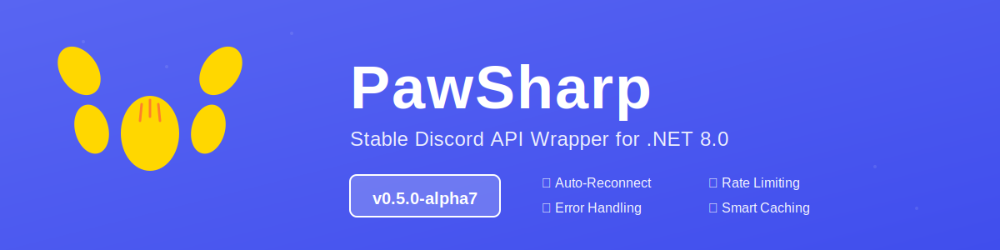

<div align="center">



</div>

# PawSharp

A Discord API wrapper for .NET 8.0 focused on modularity and transparency. This project is in active development and not yet ready for production use.

## Current Status

**Gateway stuff:**
- Connect to Discord over WebSocket with automatic heartbeating
- Listen to common events: messages, guilds, channels, members, interactions, reactions, and more
- Thread events are fully supported now

**Making API calls:**
- Messages (create, edit, delete, fetch, bulk delete, pins, reactions)
- Channels (get, modify, delete, permissions, invites)
- Guilds (info, member management, bans, roles)
- Users and current user info
- Interactions and application commands
- Threads (create, join, manage members)
- Webhooks, audit logs, scheduled events, auto-mod rules

**The actual useful bits:**
- In-memory caching (works automatically with the gateway)
- Dependency injection ready
- Type-safe entities with nullable reference types
- Snowflake ID handling
- Basic rate limit handling

## What's NOT Here Yet

- Voice support
- Redis caching (memory only)
- Advanced reconnection logic
- Comprehensive error handling
- Sharding
- Full documentation

## Getting Started

**Requirements:**
- .NET 8.0 SDK
- A bot token from [Discord Developer Portal](https://discord.com/developers/applications)

**Install:**
```bash
git clone <repository-url>
cd PawSharp
dotnet build
```

Reference it in your project and you're good to go.

### Quick Example

```csharp
using Microsoft.Extensions.DependencyInjection;
using Microsoft.Extensions.Logging;
using PawSharp.Client;
using PawSharp.Cache.Providers;
using PawSharp.API.Clients;
using PawSharp.Gateway.Events;
using PawSharp.API.Models;

// Set it up
var services = new ServiceCollection();
services.AddLogging(config => config.AddConsole());
services.AddSingleton<PawSharpOptions>(new PawSharpOptions
{
    Token = "YOUR_BOT_TOKEN",
    Intents = GatewayIntents.Guilds | GatewayIntents.GuildMessages | GatewayIntents.MessageContent
});
services.AddSingleton<IEntityCache, MemoryCacheProvider>();
services.AddHttpClient<IDiscordRestClient, DiscordRestClient>();
services.AddSingleton<DiscordClient>();
services.AddSingleton<CacheManager>();

var serviceProvider = services.BuildServiceProvider();
var client = serviceProvider.GetRequiredService<DiscordClient>();
var cacheManager = serviceProvider.GetRequiredService<CacheManager>();

cacheManager.SubscribeToGateway(client.Gateway);

// Listen for messages
client.Gateway.Events.On<MessageCreateEvent>("MESSAGE_CREATE", async (e) =>
{
    if (e.Author.Bot == true) return;
    
    if (e.Content.ToLower() == "!ping")
    {
        await client.Rest.CreateMessageAsync(e.ChannelId, new CreateMessageRequest
        {
            Content = "Pong!"
        });
    }
});

// Go
await client.ConnectAsync();
await Task.Delay(-1);
```

**Fair warning:** This is the happy path. Real bots need error handling. Some event fields can be null, so check before using them. The cache only knows about stuff that came through gateway events.

## Project Structure

- **PawSharp.API** - REST client
- **PawSharp.Gateway** - WebSocket connection and events
- **PawSharp.Cache** - Entity caching
- **PawSharp.Client** - Glues it all together
- **PawSharp.Interactions** - Slash commands and components (incomplete)

## Philosophy

1. **Pick what you need** - Don't want the cache? Don't use it.
2. **See what's happening** - Raw JSON events are available alongside typed objects.
3. **Works with DI** - Uses Microsoft.Extensions.DependencyInjection out of the box.
4. **Type-safe** - Strongly typed, nullable reference types enabled.

## Common Tasks

**Listen to events:**
```csharp
client.Gateway.Events.On<ReadyEvent>("READY", (e) =>
{
    Console.WriteLine($"Logged in as {e.User.Username}");
});

client.Gateway.Events.On<MessageCreateEvent>("MESSAGE_CREATE", async (e) =>
{
    Console.WriteLine($"[{e.ChannelId}] {e.Author.Username}: {e.Content}");
});

// If you need the raw JSON
client.Gateway.Events.OnRaw("MESSAGE_REACTION_ADD", (json) =>
{
    Console.WriteLine(json);
});
```

**Make API calls:**
```csharp
await client.Rest.CreateMessageAsync(channelId, new CreateMessageRequest
{
    Content = "Hello!"
});

await client.Rest.EditMessageAsync(channelId, messageId, new EditMessageRequest
{
    Content = "Updated"
});

var channel = await client.Rest.GetChannelAsync(channelId);
```

**Use the cache:**
```csharp
var user = client.Cache.GetUser(userId);
var guild = client.Cache.GetGuild(guildId);
var stats = client.Cache.GetEntityCount();
```

## Known Issues

- Doesn't handle edge cases well
- Rate limiting needs real-world testing
- Reconnection is bare bones
- Cache isn't optimized for huge guilds
- Documentation is sparse
- Limited examples

## What's Next

**Soon:** Better error handling, more tests, reconnection improvements, sharding

**Eventually:** Complete the interaction system, modals, voice support, performance tweaks, actual docs, NuGet package

**Later:** v1.0 with voice

## Help Out

We need:
- Tests (integration and unit)
- Better docs and examples
- Bug reports and fixes
- Finishing the interaction builders

Just clone it, build it, and send a PR.

## License

Apache License 2.0

## Links

- [Discord Docs](https://discord.com/developers/docs/intro)
- [Discord Developer Portal](https://discord.com/developers/applications)


**Status:** Alpha 4 | Still figuring things out | Entities mostly done | API endpoints next
