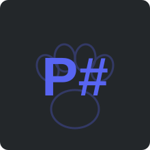

<div align="center">
  <br/><br/>

  # PawSharp

  **A modular Discord API wrapper for .NET**

  [![NuGet][nuget-badge]][nuget]
  [![Discord API][discord-api-badge]][discord-docs]
  [![.NET][dotnet-badge]][dotnet-link]
  [![License][license-badge]][license]
  [![Build][build-badge]][build]

  [Documentation][docs] &middot; [Changelog][changelog] &middot; [Examples][examples] &middot; [NuGet][nuget]

</div>

---

PawSharp is a Discord library for C# developers who want clean building blocks instead of one giant monolith.

If you want a high-level client, use `PawSharp.Client`.
If you only need specific pieces (REST, Gateway, Interactions, Voice), install just those packages.

Current release status: `1.1.0-alpha.1`.

This is a public alpha. The library is already usable, but some APIs can still evolve. See [versioning policy][versioning].

## What You Get

- REST coverage for about 140+ Discord endpoints
- Gateway connection lifecycle, heartbeat, reconnect, and session resume
- Prefix commands with preconditions and cooldowns
- Slash commands, components, and modals
- Interactivity helpers for reactions/buttons/select menus
- In-memory caching and route-aware rate limiting
- Voice support with Opus, RTP, and Discord DAVE E2EE

## Installation

Most bots should start with the full client package:

```bash
dotnet add package PawSharp.Client --version 1.1.0-alpha.2
dotnet add package PawSharp.Commands --version 1.1.0-alpha.2
dotnet add package PawSharp.Interactions --version 1.1.0-alpha.2
dotnet add package PawSharp.Interactivity --version 1.1.0-alpha.2
dotnet add package PawSharp.Voice --version 1.1.0-alpha.2
```

## Quick Start

```csharp
using PawSharp.Client;
using PawSharp.Core.Enums;

var token = Environment.GetEnvironmentVariable("DISCORD_TOKEN")
    ?? throw new InvalidOperationException("Set DISCORD_TOKEN before starting the bot.");

var client = new PawSharpClientBuilder()
    .WithToken(token)
    .WithIntents(GatewayIntents.AllNonPrivileged | GatewayIntents.MessageContent)
    .UseConsoleLogging()
    .Build();

client.OnMessageCreated(async evt =>
{
    if (evt.Author?.Bot == true)
    {
        return;
    }

    if (evt.Content == "!ping")
    {
        await client.SendMessageAsync(evt.ChannelId, "Pong!");
    }
});

await client.ConnectAsync();
await Task.Delay(Timeout.Infinite);
```

## Package Guide

- `PawSharp.Client`: recommended entry point (`DiscordClient` and fluent builder)
- `PawSharp.Core`: entities, enums, exceptions, validation, utility builders
- `PawSharp.API`: raw REST layer with advanced rate-limit handling
- `PawSharp.Gateway`: gateway connection and event dispatcher
- `PawSharp.Commands`: attribute-based prefix command framework
- `PawSharp.Interactions`: slash commands and interaction routing
- `PawSharp.Interactivity`: wait helpers for reactions/components and polls
- `PawSharp.Voice`: voice transport, Opus codec integration, DAVE E2EE support

## Dependency Injection Setup

For `Microsoft.Extensions.DependencyInjection`, use the one-call setup entrypoint:

```csharp
using PawSharp.Client.Extensions;
using PawSharp.Core.Enums;
using PawSharp.Core.Models;

services.SetupPawSharp(new PawSharpOptions
{
    Token = token,
    Intents = GatewayIntents.AllNonPrivileged | GatewayIntents.MessageContent
});

services.AddPawSharpCommands();
services.AddPawSharpInteractions();
```

## Alpha.2 Highlights

- `SetupPawSharp(options)` for simpler DI setup
- Connect-time intent validation modes (`Off`, `Warn`, `Strict`)
- Message forwarding support using Discord message reference forwarding
- Structured rate-limit telemetry from the REST client (`RateLimitObserved`)
- `EmbedTemplates` helpers for common success/error/info/warning responses

## Still In Progress

- Slash command attribute auto-registration scanner (manual registration works today)
- Dedicated Redis cache package publication (provider implementation exists)

## Documentation And Examples

- Start here: [docs/INDEX.md][docs-index]
- REST guide: [docs/REST_API_GUIDE.md][rest-guide]
- Gateway guide: [docs/GATEWAY_GUIDE.md][gateway-guide]
- Voice guide: [docs/VOICE_GUIDE.md][voice-guide]
- Troubleshooting: [docs/TROUBLESHOOTING.md][troubleshooting]
- Working sample bots: [examples][examples]

## Contributing

Contributions are welcome. Please read [CONTRIBUTING.md][contributing] before opening a pull request.

## License

PawSharp is distributed under the [MIT License][license].

---

<!-- Reference links -->
[nuget]:             https://www.nuget.org/packages/PawSharp.Client
[nuget-badge]:       https://img.shields.io/nuget/vpre/PawSharp.Client?style=flat-square&color=5865F2&label=nuget
[discord-api-badge]: https://img.shields.io/badge/Discord%20API-v10-5865F2?style=flat-square
[discord-docs]:      https://discord.com/developers/docs
[dotnet-badge]:      https://img.shields.io/badge/.NET-10.0-512BD4?style=flat-square
[dotnet-link]:       https://dotnet.microsoft.com/en-us/download/dotnet/10.0
[license-badge]:     https://img.shields.io/badge/license-MIT-22c55e?style=flat-square
[license]:           LICENSE
[build-badge]:       https://github.com/M1tsumi/PawSharp/actions/workflows/ci.yml/badge.svg
[build]:             https://github.com/M1tsumi/PawSharp/actions/workflows/ci.yml
[docs]:              https://github.com/M1tsumi/PawSharp/tree/main/docs
[docs-index]:        docs/INDEX.md
[rest-guide]:        docs/REST_API_GUIDE.md
[gateway-guide]:     docs/GATEWAY_GUIDE.md
[voice-guide]:       docs/VOICE_GUIDE.md
[troubleshooting]:   docs/TROUBLESHOOTING.md
[changelog]:         CHANGELOG.md
[examples]:          examples/
[contributing]:      CONTRIBUTING.md
[versioning]:        docs/VERSIONING_POLICY.md
