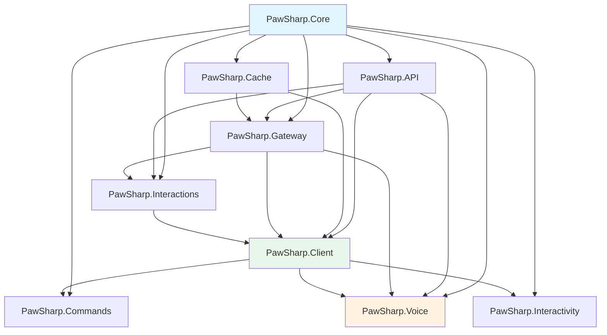

# Repository Structure

Overview of the PawSharp codebase layout.

---

## Solution structure

```
PawSharp/
├── .editorconfig # Code style configuration
├── .github/
│ └── workflows/
│ └── ci.yml # CI pipeline (build, test, pack, docs)
├── Directory.Packages.props # Central NuGet package versions
├── PawSharp.sln # Solution file (9 library + 9 test + 1 benchmark projects)
├── README.md
├── ../../CHANGELOG.md
├── CONTRIBUTING.md
├── assets/ # Logos, banners
├── docs/ # Documentation (guides, FAQ, migration)
├── examples/ # Runnable example bots
│ ├── ModerationBot/
│ ├── MusicBot/
│ └── DashboardBot/
├── src/ # Library source code (9 projects)
│ ├── Directory.Build.props # Shared package metadata, version, compiler settings
│ ├── Directory.Build.targets# SourceLink, deterministic builds
│ ├── PawSharp.Core/
│ ├── PawSharp.API/
│ ├── PawSharp.Gateway/
│ ├── PawSharp.Cache/
│ ├── PawSharp.Client/
│ ├── PawSharp.Interactions/
│ ├── PawSharp.Commands/
│ ├── PawSharp.Interactivity/
│ └── PawSharp.Voice/
├── tests/ # Test projects (9 unit + 1 benchmark)
│ ├── PawSharp.Core.Tests/
│ ├── PawSharp.API.Tests/
│ ├── PawSharp.Gateway.Tests/
│ ├── PawSharp.Cache.Tests/
│ ├── PawSharp.Client.Tests/
│ ├── PawSharp.Interactions.Tests/
│ ├── PawSharp.Commands.Tests/
│ ├── PawSharp.Interactivity.Tests/
│ ├── PawSharp.Voice.Tests/
│ └── PawSharp.Benchmarks/
└── tools/ # Build/CI scripts
 └── check-release-hygiene.ps1
```

---

## Package dependency graph



**Layering rules:**
- `PawSharp.Core` has zero project dependencies - it's the foundation
- `PawSharp.API` depends only on Core
- `PawSharp.Client` is the high-level integration package that wires everything together
- Packages never depend on test projects
- Test projects mirror library project names with `.Tests` suffix

---

## Key directories

### `src/` - Library source code

| Project | Description | Depends on |
|---|---|---|
| `PawSharp.Core` | Entities, enums, exceptions, validation, utilities | (none) |
| `PawSharp.API` | REST HTTP client, bucket rate limiting, API models | Core |
| `PawSharp.Gateway` | WebSocket client, sharding, event dispatcher, heartbeat | Core, API, Cache |
| `PawSharp.Cache` | `IEntityCache` abstractions, MemoryCacheProvider, RedisCacheProvider | Core |
| `PawSharp.Client` | `IDiscordClient`, `PawSharpClientBuilder`, DI extensions | Core, API, Gateway, Cache, Interactions |
| `PawSharp.Interactions` | Interaction handler, slash commands, components, modals, autocomplete | Core, API, Gateway |
| `PawSharp.Commands` | Attribute-based command framework, type converters, preconditions | Core, API, Client |
| `PawSharp.Interactivity` | Pagination, polls, confirmation dialogs, input prompts | Core, Client |
| `PawSharp.Voice` | Opus (Concentus), RTP, UDP, DAVE E2EE (MLS/HKDF) | Core, API, Gateway, Client |

### `tests/` - Test suite

Each library project has a corresponding test project plus a benchmarks project:

| Project | Framework | Purpose |
|---|---|---|
| `*.Tests` | xUnit + FluentAssertions + Moq | Unit + integration tests |
| `PawSharp.Benchmarks` | BenchmarkDotNet | Performance benchmarks |

### `examples/` - Runnable bots

| Example | Demonstrates |
|---|---|
| `ModerationBot` | REST operations, gateway events, basic moderation |
| `MusicBot` | DI setup, commands, voice |
| `DashboardBot` | ASP.NET integration, interaction handlers, webhook verification |

### `docs/` - Documentation

```
docs/
├── faq.md # Frequently asked questions
├── migration.md # Migration guide
├── getting-started.md # Quick start guide
├── getting-started.md # Development guide
├── guides/gateway.md # Gateway walkthrough
├── guides/sending-messages.md # REST API usage
├── guides/voice.md # Voice / DAVE E2EE
├── guides/caching.md # Caching strategies
├── guides/advanced.md # Best practices
├── guides/error-handling.md # Error handling patterns
├── guides/events.md # Intent validation
├── slash-commands.md # (referenced but not present)
├── guides/ # Topic-based mini-guides
│ ├── first-bot.md
│ ├── sending-messages.md
│ ├── slash-commands.md
│ ├── permissions.md
│ ├── voice.md
│ └── ... (15 guides)
├── images/ # Screenshots, diagrams
├── contributing/ # Contributor docs
│ ├── building-from-source.md
│ ├── repository-structure.md
│ ├── coding-guidelines.md
│ └── running-tests.md
├── index.md # Documentation index
├── toc.yml # DocFX table of contents
└── ../../CHANGELOG.md # Copy of root ../../CHANGELOG.md
```

### `tools/` - Build scripts

- `check-release-hygiene.ps1` - validates version alignment in docs, examples, and assets

### `assets/` - Branding

- `pawsharp-logo.svg` - project logo
- `pawsharp-banner.svg` - banner image

---

## `.nupkgs/` and packaging

The `nupkgs/` directory is gitignored and created by CI or local pack commands. Nine packages are produced:

| Package | ID |
|---|---|
| Core | `PawSharp.Core` |
| API | `PawSharp.API` |
| Gateway | `PawSharp.Gateway` |
| Cache | `PawSharp.Cache` |
| Client | `PawSharp.Client` |
| Interactions | `PawSharp.Interactions` |
| Commands | `PawSharp.Commands` |
| Interactivity | `PawSharp.Interactivity` |
| Voice | `PawSharp.Voice` |

All packages share the same version via `src/Directory.Build.props`. Each project produces a `.nupkg` and `.snupkg` (symbols package) when packed.

---

## CI/CD pipeline

See `.github/workflows/ci.yml`. The pipeline runs on push/PR to `main`:

1. **Release hygiene** - validates version alignment with `check-release-hygiene.ps1`
2. **Build** - `dotnet build -c Release`
3. **Test** - `dotnet test -c Release` across all test projects
4. **Pack preview** - creates NuGet preview packages on `main` pushes
5. **Documentation** - builds DocFX site and deploys to GitHub Pages
