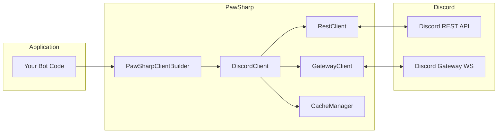

# Getting Started with PawSharp

## What is PawSharp?

PawSharp is a **modular, async-first Discord API wrapper** for .NET 10 that lets you build Discord bots with clean, idiomatic C#. Unlike wrappers that force you into a single pattern, PawSharp is designed as a set of composable NuGet packages - install only what you need, whether that's a full-featured bot client or a lightweight REST-only integration.

PawSharp provides complete coverage of the Discord REST API (140+ endpoints) and Gateway protocol (60+ events), plus higher-level frameworks for prefix commands, slash commands, message components, modals, interactivity (pagination, polls, prompts), and voice with Discord's DAVE end-to-end encryption. Every public API is `async`-first, every gateway event is a strongly-typed C# class, and the entire library is native AOT ready with source-generated JSON serialization.

The library is in active development (current version `1.1.0-alpha.5`) targeting Discord API v10. The core systems - REST, Gateway, caching, commands, interactions - are stable and tested; voice is functional but in alpha.

## Why PawSharp?

| Feature | PawSharp | DSharpPlus | Discord.Net |
|---------|----------|------------|-------------|
| **Target** | .NET 10 | .NET 8+ | .NET 8+ |
| **Modular packages** | 9 composable packages | Monolithic | Monolithic |
| **Native AOT** | Yes (source-gen JSON) | No | No |
| **Voice** | Opus + DAVE E2EE (pure .NET) | Opus (native deps) | Opus (native deps) |
| **Gateway events** | 60+ typed events | Similar | Similar |
| **Events API** | `client.OnMessageCreated(msg => ...)` | `client.MessageCreated += ...` | `client.MessageReceived += ...` |
| **Fluent builder** | `PawSharpClientBuilder` | `DiscordClientBuilder` | Constructor-based |
| **DI integration** | Built-in (`SetupPawSharp`) | Manual | Manual |
| **Rate limiting** | Automatic bucket tracking | Built-in | Built-in |
| **Caching** | Pluggable (Memory/Redis), TTL, telemetry | Built-in only | Built-in only |
| **Sharding** | Auto, manual, rebalancing | Auto + manual | Auto + manual |
| **License** | MIT | MIT | MIT |

## Architecture Overview

PawSharp's architecture follows a layered design. At the bottom are foundational packages (`Core`, `API`, `Cache`); the `Gateway` package adds real-time communication; `Client` ties them together; and higher-level packages (`Commands`, `Interactions`, `Interactivity`, `Voice`) build on top.



The bot connects to Discord via two parallel channels:

- **Gateway WebSocket** - a persistent connection for real-time events (`MessageCreated`, `GuildMemberAdded`, etc.). Managed by `GatewayClient` with automatic heartbeat, resume, and reconnection.
- **REST API** - HTTP requests for actions (send message, create channel, ban user). Managed by `RestClient` with automatic rate-limit bucket tracking.

`DiscordClient` (from `PawSharp.Client`) is the unified facade that combines both channels plus caching. You create it via `PawSharpClientBuilder` for the fluent path or via `ServiceCollection.SetupPawSharp()` for the DI path.

## Prerequisites

- [.NET 10.0 SDK](https://dotnet.microsoft.com/download/dotnet/10.0) or later
- A Discord bot token from the [Discord Developer Portal](https://discord.com/developers/applications)
- Basic familiarity with C# and async/await

## Package Ecosystem

PawSharp ships as nine NuGet packages. Install only what you need.

| Package | Description | Depends On |
|---------|-------------|------------|
| `PawSharp.Core` | Entities, enums, exceptions, `EmbedBuilder`, validators | - |
| `PawSharp.API` | `IDiscordRestClient` with 140+ typed endpoints, rate limiter | Core |
| `PawSharp.Gateway` | WebSocket connection, heartbeat, sharding, 60+ events | Core, API, Cache |
| `PawSharp.Cache` | `IEntityCache`, `MemoryCacheProvider`, `RedisCacheProvider` | Core |
| `PawSharp.Client` | `DiscordClient` facade, `CacheManager`, DI extensions | Core, API, Gateway, Cache, Interactions |
| `PawSharp.Commands` | `[Command]` attribute modules, `CommandContext`, preconditions | Core, API, Client |
| `PawSharp.Interactions` | Slash commands, component builders, modal routing | Core, API, Gateway |
| `PawSharp.Interactivity` | Reaction waits, polls, pagination helpers | Core, Client |
| `PawSharp.Voice` | Opus codec, RTP, DAVE E2EE, voice connections | Core, API, Gateway, Client |

**For most bots** you only need `PawSharp.Client` - it includes everything except Commands, Interactivity, and Voice.

## Hello, World! Bot

The following complete program creates a bot that responds to `!ping` with `Pong!`.

```csharp
using PawSharp.Client;
using PawSharp.Core.Enums;

var token = Environment.GetEnvironmentVariable("DISCORD_TOKEN")
 ?? throw new InvalidOperationException("Set the DISCORD_TOKEN environment variable.");

var client = new PawSharpClientBuilder()
 .WithToken(token)
 .WithIntents(GatewayIntents.AllNonPrivileged | GatewayIntents.MessageContent)
 .UseConsoleLogging()
 .Build();

client.OnMessageCreated(async evt =>
{
 if (evt.Author?.IsBot == true)
 return;

 if (evt.Content == "!ping")
 await client.SendMessageAsync(evt.ChannelId, "Pong!");
});

await client.ConnectAsync();
await Task.Delay(Timeout.Infinite);
```

**Expected output:**

```
> !ping
< Pong!
```

**To run:**

```bash
# Set your token (PowerShell)
$env:DISCORD_TOKEN="your_bot_token_here"

# Run the bot
dotnet run
```

>  You can also set the token permanently in your profile or launch profile, or use a `.env` file with a dotnet tool like `dotnet user-secrets`.

## Next Steps

- [Installation guide](./installation.md) &mdash; detailed package setup and build instructions
- [Your first bot](./guides/first-bot.md) &mdash; step-by-step walkthrough with commands and events
- [Gateway events](guides/gateway.md) &mdash; handling Discord's real-time events
- [Slash commands](guides/slash-commands.md) &mdash; building modern interaction-based commands
- [API reference](../api/index.md) &mdash; full type and method documentation
- [FAQ](./faq.md) &mdash; frequently asked questions
