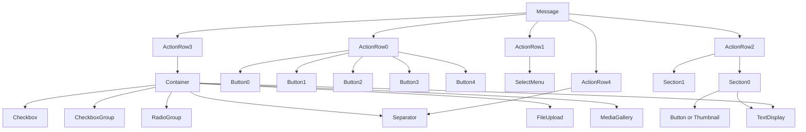

# Components

Message Components turn static messages into interactive UI elements - buttons, select menus, and the newer layout-driven Components v2 types (sections, containers, media galleries, checkboxes, radio buttons, and more).

> **Prerequisites:** [Interaction Handling](./slash-commands.md), [Slash Commands](./slash-commands.md)

---

## Overview

All components live inside a **message's `Components` list**, which follows a strict hierarchy:



**Key limits:**

| Constraint | Limit |
|---|---|
| Action rows per message | 5 |
| Components per action row | 5 |
| Buttons per action row | 5 |
| Select menus per action row | 1 |
| Containers per message | 5 |
| Sections per message | 5 |
| Media gallery items | 2 - 10 |

---

## ComponentBuilder

`ComponentBuilder` is the top-level fluent entry point. It can mix legacy (v1) `ActionRow` components and v2 layout types (`Section`, `Separator`, `Container`) in a single message.

```csharp
using PawSharp.Core.Builders;

var components = new ComponentBuilder()
 .AddActionRow(row => row
 .AddPrimaryButton("Click", "btn_click")
 .AddDangerButton("Delete", "btn_delete")
 .AddLinkButton("Docs", "https://pawsharp.dev"))
 .AddSection(section => section
 .AddText("Welcome to the server!")
 .WithButtonAccessory(btn => btn.WithStyle(ButtonStyle.Primary).WithLabel("Verify").WithCustomId("verify_btn")))
 .AddSeparator(sep => sep.WithSpacing(SeparatorSpacing.Large))
 .Build();
```

---

## Buttons

Five built-in styles are available via `ActionRowBuilder` convenience methods:

| Style | Builder Method | Color |
|---|---|---|
| `Primary` (1) | `AddPrimaryButton(label, customId)` | Blurple |
| `Secondary` (2) | `AddSecondaryButton(label, customId)` | Gray |
| `Success` (3) | `AddSuccessButton(label, customId)` | Green |
| `Danger` (4) | `AddDangerButton(label, customId)` | Red |
| `Link` (5) | `AddLinkButton(label, url)` | Gray (navigates to URL) |

For full control, use `AddButton` with a `ButtonBuilder`:

```csharp
var row = new ActionRowBuilder()
 .AddButton(b => b
 .WithStyle(ButtonStyle.Primary)
 .WithLabel("Save")
 .WithCustomId("save_btn")
 .WithEmoji(new Emoji { Name = "" })
 .WithDisabled(false))
 .AddButton(b => b
 .WithStyle(ButtonStyle.Link)
 .WithLabel("Homepage")
 .WithUrl("https://example.com"));
```

 **Do:** Use descriptive custom IDs that include context (e.g. `post_123_delete`).
 **Don't:** Put more than 5 buttons in one action row.

### Handling Button Clicks

```csharp
// Exact match
handler.RegisterComponent("save_btn", async interaction =>
{
 await handler.RespondUpdateAsync(interaction.Id, interaction.Token, "Saved!");
});

// Prefix match
handler.OnComponentWithPrefix("post_", async interaction =>
{
 var postId = interaction.Data.CustomId.Split('_')[1];
 await handler.RespondEphemeralAsync(interaction.Id, interaction.Token, $"Post {postId} clicked");
});

// Regex match
handler.OnComponentWithPattern(@"^poll_\d+_vote_\d+$", async interaction =>
{
 await handler.RespondEphemeralAsync(interaction.Id, interaction.Token, "Vote recorded!");
});
```

---

## Select Menus

### String Select Menu

Dropdown of user-defined text options.

```csharp
new ActionRowBuilder()
 .AddStringSelect(sel => sel
 .WithCustomId("color_picker")
 .WithPlaceholder("Choose a color...")
 .WithMinValues(1)
 .WithMaxValues(3)
 .AddOption(opt => opt.WithLabel("Red").WithValue("red").WithDescription("Fire truck red").WithEmoji(""))
 .AddOption(opt => opt.WithLabel("Green").WithValue("green").WithDescription("Forest green").WithDefault(true))
 .AddOption(opt => opt.WithLabel("Blue").WithValue("blue").WithDescription("Ocean blue")));
```

**Handling:**

```csharp
handler.RegisterComponent("color_picker", async interaction =>
{
 var selected = string.Join(", ", interaction.Data.Values ?? Array.Empty<string>());
 await handler.RespondUpdateAsync(interaction.Id, interaction.Token, $"You chose: {selected}");
});
```

### User Select Menu

Picks Discord users in the guild.

```csharp
new ActionRowBuilder()
 .AddUserSelect(sel => sel
 .WithCustomId("mention_user")
 .WithPlaceholder("Select a user...")
 .WithMinValues(1)
 .WithMaxValues(5));
```

```csharp
handler.RegisterComponent("mention_user", async interaction =>
{
 var userIds = interaction.Data.Resolved?.Users?.Keys;
 if (userIds != null)
 await handler.RespondUpdateAsync(interaction.Id, interaction.Token,
 $"Selected: {string.Join(", ", userIds.Select(id => $"<@{id}>"))}");
});
```

### Role Select Menu

Picks roles in the guild.

```csharp
new ActionRowBuilder()
 .AddRoleSelect(sel => sel
 .WithCustomId("role_picker")
 .WithPlaceholder("Select roles...")
 .WithMinValues(1)
 .WithMaxValues(3));
```

```csharp
handler.RegisterComponent("role_picker", async interaction =>
{
 var roleIds = interaction.Data.Values;
 // roleIds contains the selected role IDs as strings
 await handler.RespondUpdateAsync(interaction.Id, interaction.Token,
 $"Roles selected: {string.Join(", ", roleIds.Select(id => $"<@&{id}>"))}");
});
```

### Channel Select Menu

Picks channels. Filter by channel type with `WithChannelTypes`.

```csharp
new ActionRowBuilder()
 .AddChannelSelect(sel => sel
 .WithCustomId("channel_picker")
 .WithPlaceholder("Select a text channel...")
 .WithChannelTypes(new List<int> { 0 }) // 0 = GUILD_TEXT
 .WithMinValues(1)
 .WithMaxValues(1));
```

### Mentionable Select Menu

Picks users **or** roles.

```csharp
new ActionRowBuilder()
 .AddMentionableSelect(sel => sel
 .WithCustomId("mentionable_picker")
 .WithPlaceholder("Select user or role..."));
```

---

## Components v2 Layout Types

>  Components v2 requires Discord's new message layout system. Not all clients may support every feature. Check Discord's changelog for rollout status.

### Sections

A `Section` groups one or more `TextDisplay` components with an optional accessory (button or thumbnail).

```csharp
new ComponentBuilder()
 .AddSection(section => section
 .AddText("**Server Rules**\n1. Be respectful\n2. No spam\n3. Have fun!")
 .AddText("*Last updated: Jan 2026*")
 .WithThumbnailAccessory("https://example.com/rules_icon.png", "Rules icon"));
```

### Text Display

A block of text (up to 4000 characters) used inside sections and containers. Supports Markdown formatting.

```csharp
var textDisplay = new TextDisplayBuilder()
 .WithContent("This is a **rich text** display with `inline code`.")
 .Build();
```

### Separator

A visual divider between layout sections. Controls spacing and whether a line is drawn.

```csharp
new ComponentBuilder()
 .AddSeparator(sep => sep
 .WithSpacing(SeparatorSpacing.Large)
 .WithDivider(true));
```

Spacing values: `Small`, `Medium`, `Large`.

### Container

A box that groups multiple v2 components with an optional accent color and spoiler flag. Containers can nest text, sections, separators, media galleries, files, file uploads, labels, radio groups, checkbox groups, and individual checkboxes.

```csharp
new ComponentBuilder()
 .AddContainer(container => container
 .WithAccentColor(0x5865F2)
 .WithSpoiler(false)
 .AddText("### Feedback Form")
 .AddSeparator()
 .AddLabel("Rate your experience:", label => label
 .WithEmoji(""))
 .AddRadioGroup("rating", "Rating", radio => radio
 .AddOption("1 - Poor", "1")
 .AddOption("2 - Fair", "2")
 .AddOption("3 - Good", "3")
 .AddOption("4 - Excellent", "4"))
 .AddSeparator()
 .AddFileUpload("screenshot", "Screenshot (optional)", upload => upload
 .WithFileTypes("image/png", "image/jpeg")
 .WithRequired(false)
 .WithMaxLength(1))
 .AddCheckbox("agree_terms", "I agree to the terms", cb => cb
 .WithRequired(true)));
```

### Media Gallery

Displays a grid of 2 - 10 media items (images/videos).

```csharp
new ComponentBuilder()
 .AddContainer(container => container
 .AddMediaGallery(gallery => gallery
 .AddItem("https://example.com/photo1.jpg", "Sunset over mountains")
 .AddItem("https://example.com/photo2.jpg", spoiler: true)
 .AddItem(item => item
 .WithUrl("https://example.com/video.mp4")
 .WithDescription("Tutorial video"))));
```

### File / FileUpload

`File` references an already-uploaded attachment. `FileUpload` adds a file picker button.

```csharp
// Reference an uploaded file via attachment:// URL
new ComponentBuilder()
 .AddContainer(container => container
 .AddFile("attachment://report.pdf", file => file.WithSpoiler(false)));
```

```csharp
// File upload button - users click to select files
new ComponentBuilder()
 .AddContainer(container => container
 .AddFileUpload("avatar_upload", "Upload Avatar", upload => upload
 .WithFileTypes("image/png", "image/jpeg", "image/gif")
 .WithRequired(true)
 .WithMaxLength(1)));
```

Handle file upload submission via the component's custom ID:

```csharp
handler.RegisterComponent("avatar_upload", async interaction =>
{
 var attachments = interaction.Data.Resolved?.Attachments;
 if (attachments?.Count > 0)
 {
 var attachment = attachments.Values.First();
 await handler.RespondUpdateAsync(interaction.Id, interaction.Token,
 $"Uploaded: {attachment.Filename} ({attachment.Size} bytes)");
 }
});
```

### Label

A simple text + optional emoji for labeling form elements inside containers.

```csharp
new LabelBuilder("Email Address")
 .WithEmoji("")
 .Build();
```

### Radio Group

A single-select group of options. Rendered as radio buttons.

```csharp
new ComponentBuilder()
 .AddContainer(container => container
 .AddRadioGroup("difficulty", "Difficulty Level", radio => radio
 .AddOption("Easy", "easy", "Suitable for beginners")
 .AddOption("Medium", "medium", "Moderate challenge")
 .AddOption("Hard", "hard", "Expert only")
 .WithRequired(true)
 .WithDefaultValue(1)));
```

Handle radio selection:

```csharp
handler.RegisterComponent("difficulty", async interaction =>
{
 var value = interaction.Data.Values?.FirstOrDefault();
 await handler.RespondUpdateAsync(interaction.Id, interaction.Token, $"Selected: {value}");
});
```

### Checkbox Group

A multi-select group of checkboxes.

```csharp
new ComponentBuilder()
 .AddContainer(container => container
 .AddCheckboxGroup("interests", "Interests", cb => cb
 .AddOption("Coding", "coding")
 .AddOption("Music", "music", isDefault: true)
 .AddOption("Gaming", "gaming")
 .WithMinValues(1)
 .WithMaxValues(3)));
```

### Individual Checkbox

A single toggleable checkbox.

```csharp
new ComponentBuilder()
 .AddContainer(container => container
 .AddCheckbox("newsletter", "Subscribe to newsletter", cb => cb
 .WithDefaultValue(true)
 .WithRequired(false)));
```

---

## Complete Example: Feedback Form

This example combines buttons, select menus, modals, and Components v2 into a unified feedback flow.

```csharp
// --- Send the form message ---
var embed = new EmbedBuilder()
 .WithTitle("Feedback Center")
 .WithDescription("Click the button below to submit feedback")
 .WithBlurpleColor()
 .Build();

var components = new ComponentBuilder()
 .AddActionRow(row => row
 .AddPrimaryButton("Submit Feedback", "open_feedback_modal")
 .AddSecondaryButton("View Stats", "view_stats"))
 .AddSection(section => section
 .AddText("*We value your input!*")
 .WithThumbnailAccessory("https://cdn.discordapp.com/emojis/12345.png"))
 .Build();

await handler.RespondWithEmbedsAsync(interaction.Id, interaction.Token,
 "Please use the form below:", new List<Embed> { embed }, components: components);

// --- Handle the button ---
handler.RegisterComponent("open_feedback_modal", async interaction =>
{
 var modal = new ModalBuilder()
 .WithCustomId("feedback_submit")
 .WithTitle("Send Feedback")
 .AddTextInput("Your Name", "name", placeholder: "Optional", required: false, maxLength: 100)
 .AddTextInput("Feedback", "feedback_body", TextInputStyle.Paragraph,
 placeholder: "Tell us what you think...", maxLength: 2000)
 .AddTextInput("Rating (1-10)", "rating", TextInputStyle.Short,
 placeholder: "10", minLength: 1, maxLength: 2)
 .BuildResponse();

 await handler.RespondAsync(interaction.Id, interaction.Token, modal);
});

// --- Handle the modal submit ---
handler.RegisterModal("feedback_submit", async interaction =>
{
 var components = interaction.Data?.Components;
 var name = components?.FirstOrDefault()?.Components?.FirstOrDefault(c => c.CustomId == "name")?.Value ?? "Anonymous";
 var feedback = components?.SelectMany(c => c.Components ?? Enumerable.Empty<MessageComponent>())
 .FirstOrDefault(c => c.CustomId == "feedback_body")?.Value ?? "No feedback";
 var rating = components?.SelectMany(c => c.Components ?? Enumerable.Empty<MessageComponent>())
 .FirstOrDefault(c => c.CustomId == "rating")?.Value ?? "N/A";

 await handler.RespondUpdateAsync(interaction.Id, interaction.Token,
 $" Thanks {name}! Feedback received (Rating: {rating}/10).");
});
```

---

## Rate Limit Considerations

- **5 component interactions per 5 seconds** per user per channel (interaction limit).
- Defer long operations with `DeferComponentAsync` to avoid the 3-second timeout.
- Use `RespondUpdateAsync` for component interactions to edit the original message.
- Use `CreateFollowupAsync` for additional messages after the initial response.

```csharp
// Defer when processing takes more than ~2 seconds
await handler.DeferComponentAsync(interaction.Id, interaction.Token);

// Do heavy work
await Task.Delay(5000);

// Edit the deferred response
await handler.EditResponseAsync(applicationId, interaction.Token,
 new EditMessageRequest { Content = "Done!" });
```

---

## Related Guides

- [Interaction Handling](./slash-commands.md) - Registering handlers, response types
- [Modals](./modals.md) - Modal dialogs with text inputs
- [Slash Commands](./slash-commands.md) - Command registration and options
- [Attachments](./attachments.md) - File uploads and attachments
