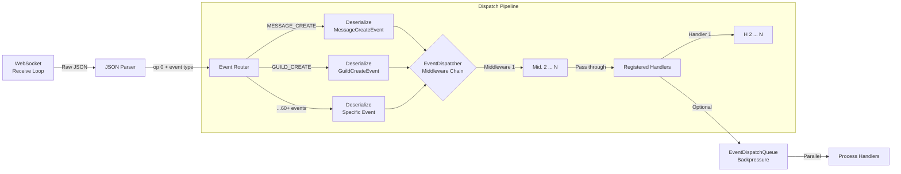

# Events

PawSharp's event system processes real-time events from the Discord Gateway. Every event flows through a dispatch pipeline — from raw JSON deserialization through middleware to your registered handlers.

---

## Event System Architecture



### How Events Flow

1. **WebSocket** receives a raw message
2. **Parser** extracts opcode, event type (e.g., `"MESSAGE_CREATE"`), and JSON data
3. **Router** dispatches by event type string to the correct deserializer
4. **Deserializer** converts JSON to a typed event object (e.g., `MessageCreateEvent`)
5. **Middleware chain** runs — can log, filter, or transform events
6. **Handlers** execute — your code runs here

---

## Subscription Patterns

PawSharp offers three subscription levels, from most convenient to most flexible.

### Pattern 1: `DiscordClient` Convenience Methods (Recommended)

Strongly typed, no magic strings, returns `IDisposable` for clean unsubscription.

```csharp
// Simple — returns IDisposable, dispose to unsubscribe
client.OnMessageCreated(async msg =>
{
    Console.WriteLine($"{msg.Author}: {msg.Content}");
});

// Named method
client.OnMessageCreated(HandleMessageReceived);

// Store and dispose later
IDisposable sub = client.OnGuildMemberJoined(WelcomeMemberAsync);

private async Task HandleMessageReceived(MessageCreateEvent msg)
{
    if (msg.Content.StartsWith("!"))
        await ProcessCommandAsync(msg);
}

private async Task WelcomeMemberAsync(GuildMemberAddEvent member)
{
    Console.WriteLine($"Welcome {member.User?.Username}!");
}
```

### Pattern 2: Low-Level `EventDispatcher`

Use `client.Gateway.Events` for fine-grained control or events without convenience wrappers.

```csharp
var dispatcher = client.Gateway.Events;

// Async handler — requires both type AND Discord event name string
dispatcher.On<ResumedEvent>("RESUMED", async resumed =>
{
    Console.WriteLine("Session resumed after reconnect");
});

// Sync handler
dispatcher.On<ResumedEvent>("RESUMED", resumed =>
{
    Console.WriteLine("Session resumed");
});

// Raw JSON handler (no deserialization)
dispatcher.OnRaw("MESSAGE_CREATE", json =>
{
    Console.WriteLine($"Raw JSON: {json}");
});

// Named method
dispatcher.On<ReadyEvent>("READY", OnReady);

private async Task OnReady(ReadyEvent ready)
{
    Console.WriteLine($"Ready as {ready.User.Username}");
    Console.WriteLine($"Session: {ready.SessionId}");
}
```

### Pattern 3: Unsubscribing

```csharp
// All subscription methods return IDisposable
IDisposable sub = client.OnMessageCreated(OnMessage);

// Unsubscribe explicitly
sub.Dispose();

// Using statement for scoped subscriptions
using (client.OnMessageCreated(OnMessage))
{
    // Handler active only within this scope
    await Task.Delay(10000);
}
// Handler automatically unsubscribed here
```

> ❌ **Common mistake:** Forgetting to store the `IDisposable` or never calling `Dispose()`. This causes **handler leaks** — your handler keeps running even after the bot disconnects.

---

## Gateway Intents and Privileged Intents

Discord requires you to declare which events you want to receive via **gateway intents**. This is a bitfield sent during identify.

```csharp
// All non-privileged intents
var options = new PawSharpOptions
{
    Token = token,
    Intents = GatewayIntents.AllNonPrivileged,
};

// Specific intents
var options = new PawSharpOptions
{
    Token = token,
    Intents = GatewayIntents.Guilds
            | GatewayIntents.GuildMessages
            | GatewayIntents.MessageContent  // PRIVILEGED
            | GatewayIntents.GuildMembers,   // PRIVILEGED
};
```

### Intent Requirements by Event Category

| Events Required | Required Intent | Privileged? |
|----------------|----------------|-------------|
| Guilds, channels, roles, emojis | `Guilds` | No |
| Members join/leave/update | `GuildMembers` | **Yes** |
| Bans, integrations, webhooks | `GuildModeration` | No |
| Emoji, sticker updates | `GuildExpressions` | No |
| Message create/update/delete | `GuildMessages` | No |
| Message reactions add/remove | `GuildMessageReactions` | No |
| Typing indicators | `GuildMessageTyping` | No |
| Direct messages | `DirectMessages` | No |
| Direct message reactions | `DirectMessageReactions` | No |
| Direct message typing | `DirectMessageTyping` | No |
| **Message content** | **`MessageContent`** | **Yes** |
| Guild scheduled events | `GuildScheduledEvents` | No |
| Voice state updates | `GuildVoiceStates` | No |
| Presence updates | `GuildPresences` | **Yes** |
| Member chunks | `GuildMembers` | **Yes** |
| Auto-moderation | `AutoModerationConfiguration` | No |
| Auto-moderation execution | `AutoModerationExecution` | No |
| Message polls | `GuildMessagePolls` | No |
| Direct message polls | `DirectMessagePolls` | No |

> ⚠️ **Warning:** Privileged intents (`GuildMembers`, `GuildPresences`, `MessageContent`) must be **enabled in the Discord Developer Portal** under "Bot > Privileged Gateway Intents". Setting them in code is not enough.

### Intent Validation

PawSharp validates that registered event handlers have their required intents enabled:

```csharp
var options = new PawSharpOptions
{
    Token = token,
    Intents = GatewayIntents.Guilds,  // Missing GuildMessages!
    IntentValidation = IntentValidationMode.Strict,
};

// client.ConnectAsync() will throw:
// "Intent validation failed: Missing required intent GuildMessages for OnMessageCreated handler"
```

| Mode | Behavior |
|------|----------|
| `Off` | No validation — you get empty events instead of errors |
| `Warning` | Logs a warning (default) |
| `Strict` | Throws `InvalidOperationException` at connect time |

---

## Event Handler Lifecycle

```mermaid
flowchart LR
    subgraph Subscribe
        A[client.OnMessageCreated<br/>handler] --> B[EventDispatcher.AddHandler]
        B --> C[Copy-on-write adds delegate]
        C --> D[Returns EventSubscription]
    end
    
    subgraph Handle
        E[Gateway message arrives] --> F[DispatchFromJsonAsync]
        F --> G[Deserialize]
        G --> H[Middleware chain]
        H --> I[Copy handlers list]
        I --> J[Invoke each handler]
    end
    
    subgraph Unsubscribe
        K[sub.Dispose()] --> L[EventSubscription.Dispose]
        L --> M[RemoveHandler]
        M --> N[Copy-on-write removes delegate]
    end
```

```csharp
// Subscribe
var sub = client.OnMessageCreated(OnMessage);

// Later, unsubscribe
sub.Dispose();

// Verify handler count
var count = client.Gateway.Events.HandlerCount("MESSAGE_CREATE");
Console.WriteLine($"Message handlers: {count}");

// You can also check queue depth if backpressure is enabled
var depth = client.Gateway.Events.QueueDepth;
Console.WriteLine($"Events queued: {depth}");
```

---

## Middleware and Event Filtering

Middleware runs before every event dispatch. You can use it for logging, metrics, filtering, or enrichment.

```csharp
var dispatcher = client.Gateway.Events;

// Log every event
dispatcher.Use(async (eventName, eventData) =>
{
    Console.WriteLine($"[{DateTime.UtcNow:O}] {eventName}");
});

// Filter: skip bot messages entirely
dispatcher.Use(async (eventName, eventData) =>
{
    if (eventData is MessageCreateEvent msg && msg.Author?.IsBot == true)
    {
        throw new EventFilteredException();  // Stops dispatch silently
    }
});

// Audit: record specific events to a database
dispatcher.Use(async (eventName, eventData) =>
{
    if (eventName is "GUILD_BAN_ADD" or "GUILD_BAN_REMOVE")
    {
        await _auditDb.RecordAsync(eventName, eventData);
    }
});
```

> 💡 **Tip:** Throwing `EventFilteredException` stops the event from reaching handlers. Other middleware still runs — use early middleware for filtering.

---

## Performance Considerations

### Parallel Dispatch

Enable parallel dispatch for high-event-volume bots:

```csharp
var options = new PawSharpOptions
{
    Token = token,
    EventDispatch = new EventDispatchOptions
    {
        EnableParallelDispatch = true,
        MaxDegreeOfParallelism = 4,
        MaxQueueSize = 10000,  // Enables backpressure queue
        HandlerTimeoutMs = 5000,  // Kill slow handlers
    },
};
```

| Setting | Default | Effect |
|---------|---------|--------|
| `EnableParallelDispatch` | `false` | Run handlers concurrently vs sequentially |
| `MaxDegreeOfParallelism` | 4 | Max concurrent handler invocations |
| `MaxQueueSize` | 0 (disabled) | Max queued events before backpressure |
| `HandlerTimeoutMs` | 0 (disabled) | Max time per handler before cancellation |

### Backpressure

When `MaxQueueSize > 0`, events are queued instead of dispatched inline. If the queue fills up, the gateway receive loop slows down naturally — preventing memory overflow.

```csharp
// Monitor queue depth
var depth = client.Gateway.Events.QueueDepth;
if (depth > 5000)
    _logger.LogWarning("Event queue depth critical: {Depth}", depth);
```

---

## Complete Event Reference

All events can be subscribed via `client.OnXxx()` convenience methods. Events marked with **low-level** require `client.Gateway.Events.On<T>("EVENT_NAME", handler)`.

### Connection Events

| Event Class | Discord Name | Convenience Method | Requires Intent |
|------------|-------------|-------------------|-----------------|
| `ReadyEvent` | `READY` | `OnReady` | None |
| `ResumedEvent` | `RESUMED` | Low-level | None |

### Message Events

| Event Class | Discord Name | Convenience Method | Requires Intent |
|------------|-------------|-------------------|-----------------|
| `MessageCreateEvent` | `MESSAGE_CREATE` | `OnMessageCreated` | `GuildMessages` / `DirectMessages` + `MessageContent`* |
| `MessageUpdateEvent` | `MESSAGE_UPDATE` | `OnMessageUpdated` | `GuildMessages` / `DirectMessages` + `MessageContent`* |
| `MessageDeleteEvent` | `MESSAGE_DELETE` | `OnMessageDeleted` | `GuildMessages` / `DirectMessages` |
| `MessageDeleteBulkEvent` | `MESSAGE_DELETE_BULK` | `OnMessagesBulkDeleted` | `GuildMessages` |
| `MessageReactionAddEvent` | `MESSAGE_REACTION_ADD` | `OnReactionAdded` | `GuildMessageReactions` / `DirectMessageReactions` |
| `MessageReactionRemoveEvent` | `MESSAGE_REACTION_REMOVE` | `OnReactionRemoved` | `GuildMessageReactions` / `DirectMessageReactions` |
| `MessageReactionRemoveAllEvent` | `MESSAGE_REACTION_REMOVE_ALL` | `OnAllReactionsRemoved` | `GuildMessageReactions` / `DirectMessageReactions` |
| `MessageReactionRemoveEmojiEvent` | `MESSAGE_REACTION_REMOVE_EMOJI` | `OnEmojiReactionsRemoved` | `GuildMessageReactions` / `DirectMessageReactions` |
| `MessagePollVoteAddEvent` | `MESSAGE_POLL_VOTE_ADD` | `OnMessagePollVoteAdded` | `GuildMessagePolls` / `DirectMessagePolls` |
| `MessagePollVoteRemoveEvent` | `MESSAGE_POLL_VOTE_REMOVE` | `OnMessagePollVoteRemoved` | `GuildMessagePolls` / `DirectMessagePolls` |

*\* `MessageContent` intent required only to receive `content`, `embed`, `attachment`, `mention` fields. Without it, `content` is `""` and other fields are empty.*

### Guild Events

| Event Class | Discord Name | Convenience Method | Requires Intent |
|------------|-------------|-------------------|-----------------|
| `GuildCreateEvent` | `GUILD_CREATE` | `OnGuildAvailable` | `Guilds` |
| `GuildUpdateEvent` | `GUILD_UPDATE` | `OnGuildUpdated` | `Guilds` |
| `GuildDeleteEvent` | `GUILD_DELETE` | `OnGuildUnavailable` | `Guilds` |
| `GuildAvailableEvent` | `GUILD_AVAILABLE` | Low-level | `Guilds` |
| `GuildUnavailableEvent` | `GUILD_UNAVAILABLE` | Low-level | `Guilds` |
| `GuildEmojisUpdateEvent` | `GUILD_EMOJIS_UPDATE` | `OnGuildEmojisUpdated` | `GuildExpressions` |
| `GuildStickersUpdateEvent` | `GUILD_STICKERS_UPDATE` | `OnGuildStickersUpdated` | `GuildExpressions` |
| `GuildIntegrationsUpdateEvent` | `GUILD_INTEGRATIONS_UPDATE` | `OnGuildIntegrationsUpdated` | `Guilds` |
| `GuildMembersChunkEvent` | `GUILD_MEMBERS_CHUNK` | `OnGuildMembersChunked` | `GuildMembers` |

### Member Events

| Event Class | Discord Name | Convenience Method | Requires Intent |
|------------|-------------|-------------------|-----------------|
| `GuildMemberAddEvent` | `GUILD_MEMBER_ADD` | `OnGuildMemberJoined` | `GuildMembers` |
| `GuildMemberUpdateEvent` | `GUILD_MEMBER_UPDATE` | `OnGuildMemberUpdated` | `GuildMembers` |
| `GuildMemberRemoveEvent` | `GUILD_MEMBER_REMOVE` | `OnGuildMemberLeft` | `GuildMembers` |

### Channel Events

| Event Class | Discord Name | Convenience Method | Requires Intent |
|------------|-------------|-------------------|-----------------|
| `ChannelCreateEvent` | `CHANNEL_CREATE` | `OnChannelCreated` | `Guilds` |
| `ChannelUpdateEvent` | `CHANNEL_UPDATE` | `OnChannelUpdated` | `Guilds` |
| `ChannelDeleteEvent` | `CHANNEL_DELETE` | `OnChannelDeleted` | `Guilds` |
| `ChannelPinsUpdateEvent` | `CHANNEL_PINS_UPDATE` | `OnChannelPinsUpdated` | `Guilds` |

### Role Events

| Event Class | Discord Name | Convenience Method | Requires Intent |
|------------|-------------|-------------------|-----------------|
| `GuildRoleCreateEvent` | `GUILD_ROLE_CREATE` | `OnRoleCreated` | `Guilds` |
| `GuildRoleUpdateEvent` | `GUILD_ROLE_UPDATE` | `OnRoleUpdated` | `Guilds` |
| `GuildRoleDeleteEvent` | `GUILD_ROLE_DELETE` | `OnRoleDeleted` | `Guilds` |

### Ban Events

| Event Class | Discord Name | Convenience Method | Requires Intent |
|------------|-------------|-------------------|-----------------|
| `GuildBanAddEvent` | `GUILD_BAN_ADD` | `OnBanAdded` | `GuildModeration` |
| `GuildBanRemoveEvent` | `GUILD_BAN_REMOVE` | `OnBanRemoved` | `GuildModeration` |

### Voice Events

| Event Class | Discord Name | Convenience Method | Requires Intent |
|------------|-------------|-------------------|-----------------|
| `VoiceStateUpdateEvent` | `VOICE_STATE_UPDATE` | `OnVoiceStateUpdated` | `GuildVoiceStates` |
| `VoiceServerUpdateEvent` | `VOICE_SERVER_UPDATE` | `OnVoiceServerUpdated` | `GuildVoiceStates` |
| `VoiceChannelEffectSendEvent` | `VOICE_CHANNEL_EFFECT_SEND` | `OnVoiceChannelEffectSent` | `GuildVoiceStates` |
| `VoiceChannelStatusUpdateEvent` | `VOICE_CHANNEL_STATUS_UPDATE` | `OnVoiceChannelStatusUpdated` | `Guilds` |

### Thread Events

| Event Class | Discord Name | Convenience Method | Requires Intent |
|------------|-------------|-------------------|-----------------|
| `ThreadCreateEvent` | `THREAD_CREATE` | `OnThreadCreated` | `Guilds` |
| `ThreadUpdateEvent` | `THREAD_UPDATE` | `OnThreadUpdated` | `Guilds` |
| `ThreadDeleteEvent` | `THREAD_DELETE` | `OnThreadDeleted` | `Guilds` |
| `ThreadListSyncEvent` | `THREAD_LIST_SYNC` | `OnThreadListSynced` | `Guilds` |
| `ThreadMemberUpdateEvent` | `THREAD_MEMBER_UPDATE` | `OnThreadMemberUpdated` | `Guilds` |
| `ThreadMembersUpdateEvent` | `THREAD_MEMBERS_UPDATE` | `OnThreadMembersUpdated` | `Guilds` |

### Interaction Events

| Event Class | Discord Name | Convenience Method | Requires Intent |
|------------|-------------|-------------------|-----------------|
| `InteractionCreateEvent` | `INTERACTION_CREATE` | `OnInteractionCreated` | `Guilds` |

### Scheduled Event Events

| Event Class | Discord Name | Convenience Method | Requires Intent |
|------------|-------------|-------------------|-----------------|
| `GuildScheduledEventCreateEvent` | `GUILD_SCHEDULED_EVENT_CREATE` | `OnScheduledEventCreated` | `GuildScheduledEvents` |
| `GuildScheduledEventUpdateEvent` | `GUILD_SCHEDULED_EVENT_UPDATE` | `OnScheduledEventUpdated` | `GuildScheduledEvents` |
| `GuildScheduledEventDeleteEvent` | `GUILD_SCHEDULED_EVENT_DELETE` | `OnScheduledEventDeleted` | `GuildScheduledEvents` |
| `GuildScheduledEventUserAddEvent` | `GUILD_SCHEDULED_EVENT_USER_ADD` | `OnScheduledEventUserAdded` | `GuildScheduledEvents` |
| `GuildScheduledEventUserRemoveEvent` | `GUILD_SCHEDULED_EVENT_USER_REMOVE` | `OnScheduledEventUserRemoved` | `GuildScheduledEvents` |

### Auto-Moderation Events

| Event Class | Discord Name | Convenience Method | Requires Intent |
|------------|-------------|-------------------|-----------------|
| `AutoModerationRuleCreateEvent` | `AUTO_MODERATION_RULE_CREATE` | `OnAutoModerationRuleCreated` | `AutoModerationConfiguration` |
| `AutoModerationRuleUpdateEvent` | `AUTO_MODERATION_RULE_UPDATE` | `OnAutoModerationRuleUpdated` | `AutoModerationConfiguration` |
| `AutoModerationRuleDeleteEvent` | `AUTO_MODERATION_RULE_DELETE` | `OnAutoModerationRuleDeleted` | `AutoModerationConfiguration` |
| `AutoModerationActionExecutionEvent` | `AUTO_MODERATION_ACTION_EXECUTION` | `OnAutoModerationActionExecuted` | `AutoModerationExecution` |

### Stage Instance Events

| Event Class | Discord Name | Convenience Method | Requires Intent |
|------------|-------------|-------------------|-----------------|
| `StageInstanceCreateEvent` | `STAGE_INSTANCE_CREATE` | `OnStageInstanceCreated` | `Guilds` |
| `StageInstanceUpdateEvent` | `STAGE_INSTANCE_UPDATE` | `OnStageInstanceUpdated` | `Guilds` |
| `StageInstanceDeleteEvent` | `STAGE_INSTANCE_DELETE` | `OnStageInstanceDeleted` | `Guilds` |

### Invite Events

| Event Class | Discord Name | Convenience Method | Requires Intent |
|------------|-------------|-------------------|-----------------|
| `InviteCreateEvent` | `INVITE_CREATE` | `OnInviteCreated` | `GuildInvites` |
| `InviteDeleteEvent` | `INVITE_DELETE` | `OnInviteDeleted` | `GuildInvites` |

### Webhook Events

| Event Class | Discord Name | Convenience Method | Requires Intent |
|------------|-------------|-------------------|-----------------|
| `WebhooksUpdateEvent` | `WEBHOOKS_UPDATE` | `OnWebhooksUpdated` | `Guilds` |

### Integration Events

| Event Class | Discord Name | Convenience Method | Requires Intent |
|------------|-------------|-------------------|-----------------|
| `IntegrationCreateEvent` | `INTEGRATION_CREATE` | `OnIntegrationCreated` | `GuildIntegrations` |
| `IntegrationUpdateEvent` | `INTEGRATION_UPDATE` | `OnIntegrationUpdated` | `GuildIntegrations` |
| `IntegrationDeleteEvent` | `INTEGRATION_DELETE` | `OnIntegrationDeleted` | `GuildIntegrations` |

### Presence Events

| Event Class | Discord Name | Convenience Method | Requires Intent |
|------------|-------------|-------------------|-----------------|
| `PresenceUpdateEvent` | `PRESENCE_UPDATE` | `OnPresenceUpdated` | `GuildPresences` |
| `TypingStartEvent` | `TYPING_START` | `OnTypingStarted` | `GuildMessageTyping` / `DirectMessageTyping` |

### User Events

| Event Class | Discord Name | Convenience Method | Requires Intent |
|------------|-------------|-------------------|-----------------|
| `UserUpdateEvent` | `USER_UPDATE` | `OnUserUpdated` | `Guilds` |

### Soundboard Events

| Event Class | Discord Name | Convenience Method | Requires Intent |
|------------|-------------|-------------------|-----------------|
| `GuildSoundboardSoundCreateEvent` | `GUILD_SOUNDBOARD_SOUND_CREATE` | `OnSoundboardSoundCreated` | `GuildExpressions` |
| `GuildSoundboardSoundUpdateEvent` | `GUILD_SOUNDBOARD_SOUND_UPDATE` | `OnSoundboardSoundUpdated` | `GuildExpressions` |
| `GuildSoundboardSoundDeleteEvent` | `GUILD_SOUNDBOARD_SOUND_DELETE` | `OnSoundboardSoundDeleted` | `GuildExpressions` |
| `GuildSoundboardSoundsUpdateEvent` | `GUILD_SOUNDBOARD_SOUNDS_UPDATE` | `OnSoundboardSoundsUpdated` | `GuildExpressions` |

### Entitlement Events

| Event Class | Discord Name | Convenience Method | Requires Intent |
|------------|-------------|-------------------|-----------------|
| `EntitlementCreateEvent` | `ENTITLEMENT_CREATE` | `OnEntitlementCreated` | `Guilds` / `Entitlements` |
| `EntitlementUpdateEvent` | `ENTITLEMENT_UPDATE` | `OnEntitlementUpdated` | `Guilds` / `Entitlements` |
| `EntitlementDeleteEvent` | `ENTITLEMENT_DELETE` | `OnEntitlementDeleted` | `Guilds` / `Entitlements` |

### Subscription Events

| Event Class | Discord Name | Convenience Method | Requires Intent |
|------------|-------------|-------------------|-----------------|
| `SubscriptionCreateEvent` | `SUBSCRIPTION_CREATE` | `OnSubscriptionCreated` | `Guilds` |
| `SubscriptionUpdateEvent` | `SUBSCRIPTION_UPDATE` | `OnSubscriptionUpdated` | `Guilds` |
| `SubscriptionDeleteEvent` | `SUBSCRIPTION_DELETE` | `OnSubscriptionDeleted` | `Guilds` |

### Audit Log Events

| Event Class | Discord Name | Convenience Method | Requires Intent |
|------------|-------------|-------------------|-----------------|
| `GuildAuditLogEntryCreateEvent` | `GUILD_AUDIT_LOG_ENTRY_CREATE` | `OnGuildAuditLogEntryCreated` | `GuildModeration` |

### App Command Permission Events

| Event Class | Discord Name | Convenience Method | Requires Intent |
|------------|-------------|-------------------|-----------------|
| `ApplicationCommandPermissionsUpdateEvent` | `APPLICATION_COMMAND_PERMISSIONS_UPDATE` | `OnApplicationCommandPermissionsUpdated` | `Guilds` |

### Shard Events (Manager-Level)

| Event Class | Discord Name | Convenience Method | Requires Intent |
|------------|-------------|-------------------|-----------------|
| `ShardConnectedEvent` | `SHARD_CONNECTED` | Low-level | None |
| `ShardDisconnectedEvent` | `SHARD_DISCONNECTED` | Low-level | None |
| `ShardFailedEvent` | `SHARD_FAILED` | Low-level | None |

---

## Common Mistakes

### ❌ Missing Intents

```csharp
// Message content will always be empty!
var options = new PawSharpOptions
{
    Token = token,
    Intents = GatewayIntents.Guilds | GatewayIntents.GuildMessages,
    // Missing: GatewayIntents.MessageContent
};

// msg.Content will be "" even with GuildMessages intent
client.OnMessageCreated(msg =>
{
    Console.WriteLine(msg.Content);  // Always empty!
});
```

### ❌ Blocking in Handlers

```csharp
// BAD: Blocks the gateway receive loop
client.OnMessageCreated(msg =>
{
    Task.Delay(1000).Wait();  // Blocks thread!
    Thread.Sleep(500);        // Blocks thread!
});

// GOOD: Use async all the way
client.OnMessageCreated(async msg =>
{
    await Task.Delay(1000);
    await ProcessAsync(msg);
});
```

### ❌ Forgetting to Acknowledge Interactions

```csharp
// BAD: 3-second timeout, Discord shows "interaction failed"
client.OnInteractionCreated(async interaction =>
{
    await DoLongWorkAsync();  // Takes 10 seconds
});

// GOOD: Defer first, then edit later
client.Interactions.RegisterCommand("slow", async interaction =>
{
    await client.Interactions.DeferAsync(interaction.Id, interaction.Token);
    var result = await DoLongWorkAsync();
    await client.Interactions.EditResponseAsync(appId, interaction.Token, new EditMessageRequest
    {
        Content = result,
    });
});
```

### ❌ Subscribing After Connect

```csharp
// BAD: You may miss the READY event
await client.ConnectAsync();

// READY already fired — handler never runs
client.OnReady(ready => { ... });

// GOOD: Subscribe before connecting
client.OnReady(ready => { ... });
await client.ConnectAsync();
```

---

## Best Practices Summary

| Practice | Benefit |
|----------|---------|
| ✅ Subscribe to events **before** `ConnectAsync()` | Catches early events like READY |
| ✅ Use async handlers, never `.Result` or `.Wait()` | Prevents deadlocks and thread pool starvation |
| ✅ Store and dispose `IDisposable` subscriptions | Prevents handler leaks on reconnect |
| ✅ Offload heavy work to a background channel | Keeps dispatch pipeline fast |
| ✅ Wrap handlers in try/catch | Prevents one handler from crashing others |
| ✅ Enable only intents you actually use | Lower memory, faster dispatch |
| ✅ Use middleware for cross-cutting concerns | Avoids duplicating logic in every handler |
| ✅ Monitor `QueueDepth` in production | Early warning for processing bottlenecks |
| ❌ Don't subscribe to `MessageContent` unless needed | Privileged intent — must be enabled in portal |
| ❌ Don't block or do synchronous I/O in handlers | Blocks the gateway receive loop |

---

## Related Guides

- [Gateway Connection](./gateway.md) — Connection lifecycle, sharding, heartbeat
- [Receiving Messages](./receiving-messages.md) — Working with message events
- [Sending Messages](./sending-messages.md) — REST API message operations
- [Slash Commands](./slash-commands.md) — Interaction handling
