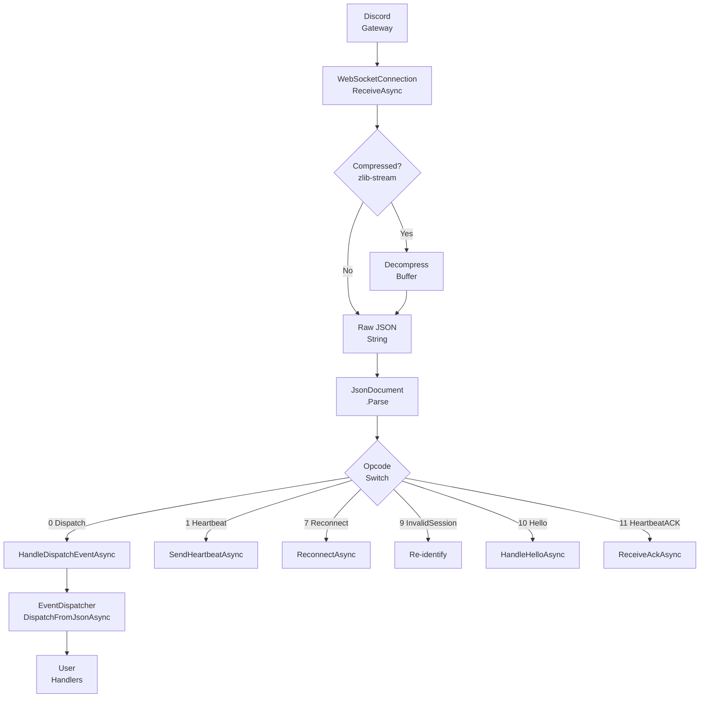
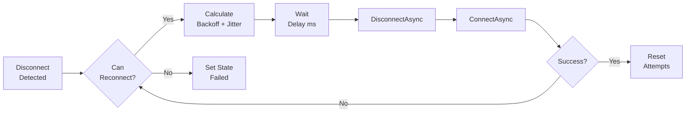

# Gateway Pipeline

The gateway pipeline processes WebSocket messages from Discord: receive, decompress (if zlib-stream), parse JSON, dispatch events, and manage heartbeats/reconnection.

---

## Message Flow



---

## WebSocket Connection

`WebSocketConnection` wraps `ClientWebSocket` with:

- **ArrayPool buffers** - rents `byte[]` from `ArrayPool<byte>.Shared`
- **zlib-stream decompression** - uses `DeflateStream` when `EnableCompression` is true
- **Configurable buffer size** - `WebSocketBufferSizeKb` in options

```csharp
public async Task<string?> ReceiveAsync(CancellationToken ct)
{
 byte[] buffer = ArrayPool<byte>.Shared.Rent(_bufferSize);
 try
 {
 var result = await _webSocket.ReceiveAsync(buffer, ct);
 // zlib decompress if needed
 return Encoding.UTF8.GetString(decompressed, 0, decompressed.Length);
 }
 finally { ArrayPool<byte>.Shared.Return(buffer); }
}
```

---

## Compression Handling

zlib-stream compression is enabled by default:

```csharp
var uri = new Uri($"{gatewayHost}?v={_options.ApiVersion}&encoding=json{if (_options.EnableCompression) "&compress=zlib-stream"}");
await _webSocket.ConnectAsync(uri, ct);
```

---

## Rate Limiting Gateway Sends

Discord allows 120 gateway commands per 60 seconds per connection (heartbeats exempt). Implemented as a token-bucket with `SemaphoreSlim`:

```csharp
private readonly SemaphoreSlim _wsRateLimiter = new(120, 120);

private async Task GatewaySendAsync(string json, CancellationToken ct, bool isHeartbeat = false)
{
 if (!isHeartbeat)
 {
 await _wsRateLimiter.WaitAsync(ct);
 _ = Task.Run(async () =>
 {
 await Task.Delay(60_000, releaseCt);
 _wsRateLimiter.Release();
 });
 }
 await _webSocket.SendAsync(json, ct);
}
```

---

## Heartbeat Lifecycle

```
┌────────┐ ┌─────────────┐ ┌─────────┐
│ Client │ │ Heartbeat │ │ Discord │
│ │ │ Manager │ │ │
└────────┘ └─────────────┘ └─────────┘
 │ │ │
 │ Opcode 10: │ │
 │ heartbeat_interval │
 │─────────────────>│ │
 │ │ │
 │ Opcode 1: │ │
 │ Heartbeat │ │
 │<─────────────────│ │
 │ │─────────────────>│
 │ │ │
 │ Opcode 11: │ │
 │ Heartbeat ACK │ │
 │ │<─────────────────│
 │ │ │
 │ ReceiveAckAsync │ │
 │ │ │
 │ (repeat every │ │
 │ heartbeat_interval) │
```

- `HeartbeatManager` sends heartbeats at the interval from opcode 10
- `_lastHeartbeatSent` timestamp recorded for latency measurement
- Zombie connection detected after `MaxMissedHeartbeatAcks` missed ACKs

```csharp
_lastHeartbeatLatency = DateTimeOffset.UtcNow - _lastHeartbeatSent.Value;
_metrics?.RecordHeartbeatLatency((long)_lastHeartbeatLatency.Value.TotalMilliseconds);
await _heartbeatManager.ReceiveAckAsync();
```

---

## Reconnect Flow



`ReconnectionManager` exponential backoff:

```csharp
var jitter = (int)(_currentBackoffMs * _jitterFactor * (2.0 * Random.Shared.NextDouble() - 1.0));
delayMs = Math.Max(0, _currentBackoffMs + jitter);
_currentBackoffMs = Math.Min(_currentBackoffMs * 2, _maxBackoffMs);
```

---

## Event Dispatch Queue

`EventDispatcher` maintains a channel-based queue with:

```csharp
_eventDispatcher = new EventDispatcher(
 logger,
 options.EventDispatch.MaxQueueSize, // channel capacity
 options.EventDispatch.EnableParallelDispatch,
 options.EventDispatch.MaxDegreeOfParallelism,
 metrics,
 options.EventDispatch.HandlerTimeoutMs);
```

Events are dispatched from `HandleDispatchEventAsync` via `DispatchFromJsonAsync<T>`.

---

## Extending the Pipeline

1. **Custom middleware** for pre-processing events:
```csharp
client.Gateway.Events.Use(async (eventName, eventData) =>
{
 _metrics.RecordGatewayMessage(eventName);
});
```

2. **Custom event handlers** via `Events.On<T>(eventName, handler)`.

3. **Custom reconnection strategy** - set `OnReconnectionAttempt` and `OnReconnectionFailed`:
```csharp
client.Gateway.OnReconnectionAttempt += async attempt =>
{
 await NotifyAdminAsync($"Reconnecting (attempt {attempt})");
};
```

---

## Common Mistakes

| Mistake | Solution |
|---------|----------|
| Blocking in event handlers | Use async; handlers should not block |
| Not checking `_webSocket.CloseStatus` | Handle close codes for auth/rate-limit errors |
| Ignoring zombie connection detection | Subscribes to `OnZombieConnection` by default |
| Sending non-heartbeat commands without rate limit | Use `GatewaySendAsync` not raw WebSocket send |
| Resetting session on `InvalidSequence` (4007) | Clear `_resumeSessionId` and re-identify |
