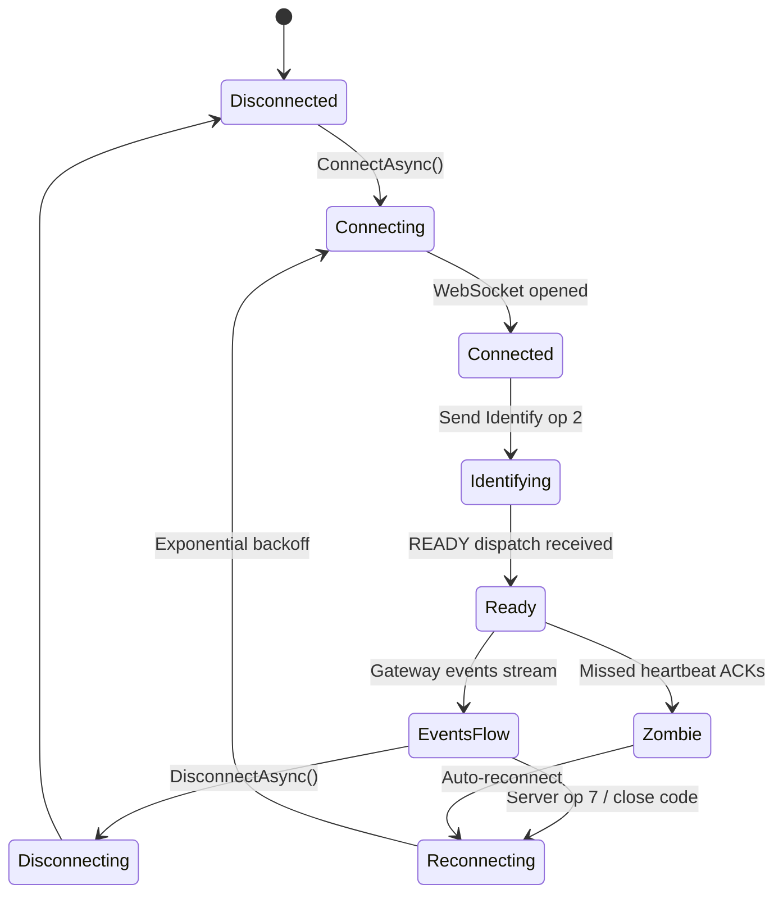
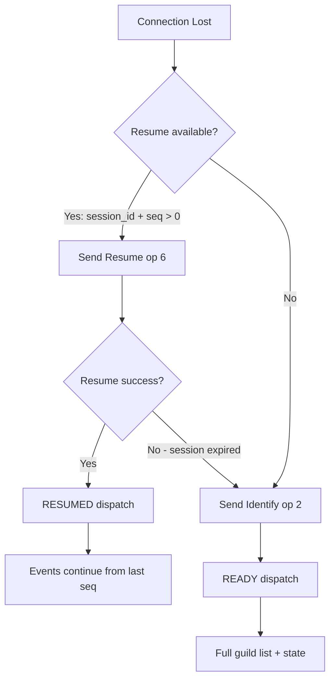
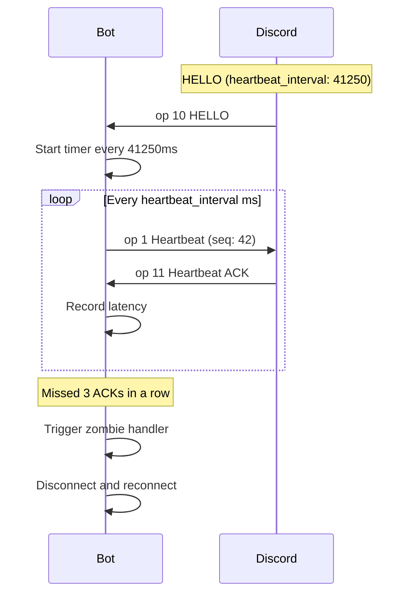
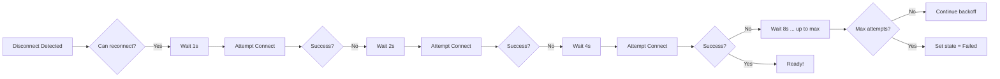
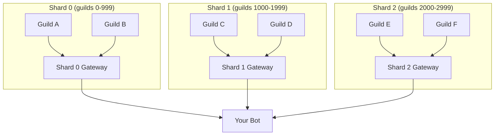

# Gateway Connection

The Discord Gateway is a persistent WebSocket connection that delivers real-time events to your bot. Unlike the REST API — where you request data — the Gateway *pushes* data to you as it happens: messages, member joins, channel updates, voice state changes, and more.

---

## What Is the Gateway?

The Gateway is Discord's server-push mechanism. Your bot opens a single WebSocket connection and Discord streams events over it. This is how your bot knows about new messages without polling the REST API every few milliseconds.

| Aspect | REST API | Gateway |
|--------|----------|---------|
| **Pattern** | Request / Response | Publish / Subscribe |
| **Connection** | HTTP (stateless) | WebSocket (persistent) |
| **Latency** | 50–200ms per call | <5ms event delivery |
| **Use for** | Sending messages, creating roles, fetching data | Listening to real-time events |

> 💡 **Tip:** Think of the Gateway as your bot's "ears" — it hears everything happening in Discord. The REST API is your bot's "mouth" — it speaks back.

---

## Connection Lifecycle



### States

| State | Description |
|-------|-------------|
| `Disconnected` | No connection to Discord |
| `Connecting` | WebSocket handshake in progress |
| `Connected` | WebSocket established, awaiting HELLO |
| `Ready` | Bot authenticated, events flowing |
| `Failed` | Unrecoverable error (bad token, invalid intents) |

---

## ConnectAsync — Starting the Connection

`GatewayClient.ConnectAsync()` orchestrates the full connection sequence:

1. **Fetch gateway URL** — calls `GET /gateway/bot` (cached for 24h) or uses `resume_gateway_url`
2. **Open WebSocket** — connects to `wss://gateway.discord.gg?v=10&encoding=json`
3. **Receive HELLO** — Discord sends opcode 10 with `heartbeat_interval`
4. **Send Identify or Resume** — opcode 2 (fresh) or opcode 6 (resume existing session)
5. **Receive READY or RESUMED** — opcode 0 dispatch confirms the session

```csharp
// Basic connection with error handling
public async Task RunBotAsync()
{
    try
    {
        await client.ConnectAsync();
        Console.WriteLine($"Connected as {client.CurrentUser?.Username}");
        await Task.Delay(Timeout.Infinite);
    }
    catch (InvalidOperationException ex) when (ex.Message.Contains("intent"))
    {
        Console.WriteLine($"Intent validation failed: {ex.Message}");
    }
    catch (Exception ex)
    {
        Console.WriteLine($"Connection failed: {ex.Message}");
    }
    finally
    {
        await client.DisconnectAsync();
    }
}
```

```csharp
// Connection state monitoring
client.ConnectionStateChanged += (sender, state) =>
{
    Console.WriteLine($"Connection state: {state}");
};

client.OnReady(ready =>
{
    Console.WriteLine($"Ready! Logged in as {ready.User.Username}");
    Console.WriteLine($"Session ID: {ready.SessionId}");
    Console.WriteLine($"Guilds: {ready.Guilds.Count}");
    return Task.CompletedTask;
});
```

### Custom Gateway URL

For testing or staging environments, you can override the gateway URL:

```csharp
var options = new PawSharpOptions
{
    Token = token,
    CustomGatewayUrl = "wss://my-proxy.example.com",
};
```

> ⚠️ **Warning:** Custom gateway URLs bypass Discord's `resume_gateway_url` logic. Resuming sessions may not work.

---

## Resume vs Fresh Identify

When a connection drops, Discord gives you 30–60 seconds to **resume** the session rather than starting over.



### How Resume Works

```csharp
// Resume is handled automatically — no code needed.
// But you can detect it:
client.Gateway.Events.On<ResumedEvent>("RESUMED", resumed =>
{
    Console.WriteLine("Session resumed — no state lost!");

    // Check current latency
    var latency = client.Gateway.LastHeartbeatLatency;
    if (latency.HasValue)
        Console.WriteLine($"Heartbeat latency: {latency.Value.TotalMilliseconds}ms");

    return Task.CompletedTask;
});
```

### When Resume Fails

- **InvalidSequence (4007):** The last sequence number Discord has is too old — session discarded, fresh identify required.
- **SessionTimedOut (4009):** More than 60 seconds elapsed — must re-identify.
- **AuthenticationFailed (4004):** Token is bad — unrecoverable, do not retry.

---

## Heartbeat Mechanism and Zombie Detection

The heartbeat ensures the connection is alive. Discord sends the `heartbeat_interval` (milliseconds) in the HELLO opcode. PawSharp sends a heartbeat opcode 1 at that interval.



### Zombie Detection

A **zombie connection** is when the WebSocket appears open but Discord stops responding. PawSharp detects this by counting missed heartbeat acknowledgements.

```csharp
// Configure zombie sensitivity (default: 3 missed ACKs)
var options = new PawSharpOptions
{
    Token = token,
    MaxMissedHeartbeatAcks = 5,  // More lenient
};
```

```csharp
// Monitor heartbeat latency
// Exposed on IGatewayClient:
var latency = client.Gateway.LastHeartbeatLatency;
if (latency?.TotalMilliseconds > 500)
    Console.WriteLine($"High gateway latency: {latency.Value.TotalMilliseconds}ms");
```

> 💡 **Tip:** Normal heartbeat latency is 10–100ms. Values consistently over 300ms may indicate network issues or geographic distance from Discord's gateway.

---

## Reconnection with Exponential Backoff

When the connection drops (or Discord sends opcode 7), PawSharp automatically reconnects with exponential backoff.



### Configuration

```csharp
var options = new PawSharpOptions
{
    Token = token,
    Reconnection = new ReconnectionOptions
    {
        MaxAttempts = 10,
        BaseDelayMs = 1000,
        MaxDelayMs = 30000,
    },
};
```

### Monitoring Reconnections

```csharp
// Low-level gateway state changes
client.Gateway.OnStateChanged += async (oldState, newState) =>
{
    Console.WriteLine($"Gateway: {oldState} -> {newState}");
    if (newState == GatewayState.Failed)
    {
        Console.WriteLine("Gateway failed — check your token and intents.");
        // Attempt manual recovery
        await client.ReconnectAsync();
    }
};

// Reconnection attempts
client.Gateway.OnReconnectionAttempt += async (attempt) =>
{
    Console.WriteLine($"Reconnection attempt #{attempt}");
};

// Reconnection exhausted
client.Gateway.OnReconnectionFailed += async () =>
{
    Console.WriteLine("All reconnection attempts failed.");
    // Notify monitoring, exit gracefully
};
```

> ✅ **Good:** Always subscribe to `OnReconnectionFailed` in production. Log it, alert on it, and consider restarting the process.

> ❌ **Bad:** Silently swallowing reconnection failures. Your bot appears online but receives no events.

---

## Sharding Overview

When your bot is in 2,500+ guilds, Discord requires **sharding** — splitting the guild load across multiple gateway connections.



### How Sharding Works

Each shard is a separate WebSocket connection. Discord assigns each guild to a shard using:

```
shard_id = (guild_id >> 22) % total_shards
```

PawSharp handles this distribution automatically via `ShardManager`.

```csharp
// Auto-configure shard count from Discord's recommendation
var recommended = await shardManager.CalculateRecommendedShardCountAsync();
Console.WriteLine($"Discord recommends {recommended} shards");

// Or use the static heuristic
var shards = ShardManager.CalculateRecommendedShardCount(3500);
// Returns: 4 (3500 / 1000 = 3.5, ceiling = 4)
```

### Using ShardManager

```csharp
// Configure sharding
var options = new PawSharpOptions
{
    Token = token,
    ShardCount = 4,  // or use ShardingStrategy.Auto in DI setup
    ShardConnectionDelayMs = 5500,  // 5.5s between shard connects
};

// Via DI
services.AddSingleton(options);
services.AddPawSharp();  // ShardManager is registered automatically

// Manual usage
var shardManager = provider.GetRequiredService<ShardManager>();

// Connect all shards (rate-limit aware)
await shardManager.ConnectAllAsync();
Console.WriteLine($"Connected shards: {shardManager.ConnectedShardCount}/{shardManager.ShardCount}");

// Get shard status
foreach (var (id, status) in shardManager.GetAllShardStatuses())
    Console.WriteLine($"Shard {id}: {status}");
```

### Shard-Specific Operations

```csharp
// Events from all shards are unified — subscribe once
client.OnMessageCreated(msg =>
{
    // Fires for messages on any shard
});

// Access a specific shard for diagnostics
var shard3 = shardManager.GetShard(3);
if (shard3 != null)
{
    Console.WriteLine($"Shard 3 state: {shard3.CurrentState}");
    Console.WriteLine($"Shard 3 latency: {shard3.LastHeartbeatLatency?.TotalMilliseconds}ms");
}

// Find which shard handles a guild
var guildId = 123456789012345678UL;
var shardId = shardManager.GetShardIdForGuild(guildId);
Console.WriteLine($"Guild {guildId} is on shard {shardId}");
```

> 💡 **Tip:** Most bots don't need sharding until ~1,000 guilds. Discord's hard limit is 2,500 guilds on a single shard. Use `CalculateRecommendedShardCount(guildCount)` to determine when to start.

---

## Presence Management

Update your bot's status (online, idle, DND, invisible) and activity.

```csharp
// Set online with a "Playing" activity
await client.Gateway.UpdatePresenceAsync("online", "with PawSharp");

// Set idle with streaming status
await client.Gateway.UpdatePresenceAsync("idle", "PawSharp Stream", "https://twitch.tv/example");

// Go invisible
await client.Gateway.UpdatePresenceAsync("invisible");

// Clear activity (stay online)
await client.Gateway.UpdatePresenceAsync("online");
```

> ⚠️ **Warning:** Presence updates are rate-limited to 5 per minute per connection. Sending more will cause Discord to silently drop them.

---

## Common Connection Issues and Solutions

| Issue | Close Code | Cause | Fix |
|-------|-----------|-------|-----|
| Authentication Failed | 4004 | Token is wrong or malformed | Verify `Bot ` prefix and token in Discord Developer Portal |
| Invalid Intents | 4013 | Intent value doesn't exist | Check `GatewayIntents` enum values |
| Disallowed Intent | 4014 | Privileged intent not enabled in portal | Enable Message Content, Guild Members, or Presence Intents in Developer Portal |
| Invalid Shard | 4010 | Shard ID >= total shards | Ensure shard_id < total_shards |
| Sharding Required | 4011 | Bot is in 2,500+ guilds without sharding | Enable sharding via `ShardCount` |
| Rate Limited | 4008 | Too many identify requests | Increase `ShardConnectionDelayMs` |
| Session Timed Out | 4009 | Resume took too long | Reduce time between disconnect and reconnect |

### Debugging with Gateway Diagnostics

```csharp
var diag = client.Gateway.Diagnostics;
Console.WriteLine($"Heartbeats sent: {diag.HeartbeatsSent}");
Console.WriteLine($"Heartbeats ACKed: {diag.HeartbeatsAcknowledged}");
Console.WriteLine($"Events received: {diag.TotalEventsReceived}");
Console.WriteLine($"Reconnections: {diag.TotalReconnections}");
Console.WriteLine($"Last errors: {string.Join(", ", diag.RecentErrors)}");
```

---

## Graceful Shutdown

Always disconnect cleanly to allow session resume on next start.

```csharp
public class BotHost
{
    private readonly DiscordClient _client;
    private readonly CancellationTokenSource _cts = new();

    public BotHost(DiscordClient client)
    {
        _client = client;
        Console.CancelKeyPress += OnCancelKeyPress;
    }

    public async Task RunAsync()
    {
        await _client.ConnectAsync();
        try
        {
            await Task.Delay(Timeout.Infinite, _cts.Token);
        }
        catch (OperationCanceledException)
        {
            // Expected on shutdown
        }
    }

    private async void OnCancelKeyPress(object? sender, ConsoleCancelEventArgs e)
    {
        e.Cancel = true;
        Console.WriteLine("Shutting down gracefully...");
        await _client.DisconnectAsync();
        _cts.Cancel();
    }
}
```

---

## Best Practices

| Practice | Why |
|----------|-----|
| ✅ Always handle `OnReconnectionFailed` | Prevents silent failures in production |
| ✅ Set up global exception handlers | Catches unhandled task exceptions |
| ✅ Use `ConfigureAwait(false)` in library code | Reduces deadlock risk in sync contexts |
| ✅ Monitor `LastHeartbeatLatency` | Early warning for network issues |
| ❌ Don't block in event handlers | Blocks the gateway receive loop |
| ❌ Don't reconnect on auth failure (4004) | Token is invalid — retrying wastes rate limits |
| ❌ Don't ignore intent validation | Missing intents = missing events |

```csharp
// Production-ready global exception handlers
DiscordClient.SetupGlobalExceptionHandlers(
    logger: logger,
    onUnhandledException: (ex, msg) =>
    {
        File.WriteAllText("crash.log", $"{msg}: {ex}");
        Environment.Exit(1);
    });
```

---

## Related Guides

- [Events](./events.md) — Subscribing to gateway events and the event dispatch pipeline
- [Receiving Messages](./receiving-messages.md) — Handling message events
- [Sending Messages](./sending-messages.md) — Using the REST API to send messages
- [Slash Commands](./slash-commands.md) — Building and handling application commands
