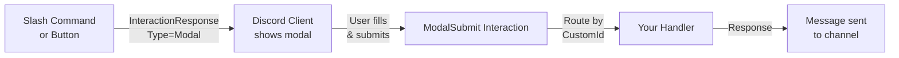

# Modals

Modals are pop-up forms that let you collect structured text input from users. They are triggered by interaction responses — typically from a slash command, button click, or select menu selection.

> **Prerequisites:** [Interaction Handling](./interactions.md), [Components](./components.md)

---

## What Are Modals?

A modal is a Discord dialog box that appears in the client overlay. It contains:
- A **title** (top of the dialog)
- A **custom ID** (used to route the submission back to your handler)
- One or more **text input fields** (short single-line or long paragraph)



---

## Creating a Modal

Use `ModalBuilder` from `PawSharp.Interactions.Builders`:

```csharp
using PawSharp.Interactions.Builders;

var modal = new ModalBuilder()
    .WithCustomId("feedback_modal")
    .WithTitle("Send Feedback")
    .AddTextInput(
        label: "Your Name",
        customId: "name_input",
        style: TextInputStyle.Short,
        required: false,
        placeholder: "Optional",
        maxLength: 100)
    .AddTextInput(
        label: "Feedback",
        customId: "feedback_body",
        style: TextInputStyle.Paragraph,
        required: true,
        placeholder: "Tell us what you think...",
        minLength: 10,
        maxLength: 2000)
    .BuildResponse();

// Send as an interaction response
await handler.RespondAsync(interaction.Id, interaction.Token, modal);
```

### TextInputStyle

| Value | Style | Display |
|---|---|---|
| `Short` (1) | Single-line text box | Default for short answers |
| `Paragraph` (2) | Multi-line text area | Longer responses |

### Text Input Properties

| Property | Limit | Notes |
|---|---|---|
| `Label` | 45 chars | Shown above the input |
| `CustomId` | 100 chars | Used to retrieve the value on submit |
| `Placeholder` | 100 chars | Shown when empty |
| `MinLength` | 0–4000 | Minimum character count |
| `MaxLength` | 1–4000 | Maximum character count |
| `Value` | 4000 chars | Pre-filled default value |

---

## Sending a Modal

Modals can only be sent as an **interaction response**. You cannot send a modal on its own — it must be in reply to a slash command, button click, select menu interaction, or context menu command.

```csharp
// From a slash command handler
handler.RegisterCommand("feedback", async interaction =>
{
    var modal = new ModalBuilder()
        .WithCustomId("feedback_modal")
        .WithTitle("Feedback")
        .AddTextInput("Feedback", "body", TextInputStyle.Paragraph, required: true)
        .BuildResponse();

    await handler.RespondAsync(interaction.Id, interaction.Token, modal);
});

// From a button handler
handler.RegisterComponent("open_modal_btn", async interaction =>
{
    var modal = new ModalBuilder()
        .WithCustomId("feedback_modal")
        .WithTitle("Quick Feedback")
        .AddTextInput("Your message", "msg", TextInputStyle.Paragraph, maxLength: 500)
        .BuildResponse();

    await handler.RespondAsync(interaction.Id, interaction.Token, modal);
});
```

---

## Handling Modal Submissions

Register a handler with `RegisterModal` using the same `customId` you set in the builder:

```csharp
handler.RegisterModal("feedback_modal", async interaction =>
{
    // Flatten all components to find your inputs
    var allInputs = interaction.Data?.Components?
        .SelectMany(row => row.Components ?? Enumerable.Empty<MessageComponent>())
        .ToList();

    var name = allInputs?.FirstOrDefault(c => c.CustomId == "name_input")?.Value ?? "Anonymous";
    var body = allInputs?.FirstOrDefault(c => c.CustomId == "feedback_body")?.Value ?? "";

    await handler.RespondEphemeralAsync(interaction.Id, interaction.Token,
        $"✅ Thanks {name}! Your feedback has been recorded.");
});
```

### Accessing Values Safely

```csharp
handler.RegisterModal("order_modal", async interaction =>
{
    // Helper extension method pattern
    string GetValue(string customId)
    {
        return interaction.Data?.Components?
            .SelectMany(c => c.Components ?? Enumerable.Empty<MessageComponent>())
            .FirstOrDefault(c => c.CustomId == customId)?.Value ?? string.Empty;
    }

    var product = GetValue("product_name");
    var quantity = GetValue("quantity");
    var notes = GetValue("special_instructions");

    if (string.IsNullOrEmpty(product))
    {
        await handler.RespondEphemeralAsync(interaction.Id, interaction.Token,
            "❌ Product name is required.");
        return;
    }

    await handler.RespondUpdateAsync(interaction.Id, interaction.Token,
        $"✅ Ordered {quantity}x {product}.");
});
```

---

## Complete Walkthrough

A full example: slash command → modal → submission → confirmation.

```csharp
// 1. Register the slash command
handler.RegisterCommand("report", async interaction =>
{
    var modal = new ModalBuilder()
        .WithCustomId("report_user")
        .WithTitle("Report a User")
        .AddTextInput("User ID", "user_id", TextInputStyle.Short, required: true,
            placeholder: "Paste the user's ID", minLength: 17, maxLength: 20)
        .AddTextInput("Reason", "reason", TextInputStyle.Paragraph, required: true,
            placeholder: "Describe the issue...", minLength: 10, maxLength: 1000)
        .AddTextInput("Evidence link (optional)", "evidence", TextInputStyle.Short,
            required: false, placeholder: "https://...")
        .BuildResponse();

    await handler.RespondAsync(interaction.Id, interaction.Token, modal);
});

// 2. Handle the modal submission
handler.RegisterModal("report_user", async interaction =>
{
    string GetVal(string cid) =>
        interaction.Data?.Components?
            .SelectMany(c => c.Components ?? Enumerable.Empty<MessageComponent>())
            .FirstOrDefault(c => c.CustomId == cid)?.Value ?? "";

    var userId = GetVal("user_id");
    var reason = GetVal("reason");
    var evidence = GetVal("evidence");

    // Validate
    if (!ulong.TryParse(userId, out var _))
    {
        await handler.RespondEphemeralAsync(interaction.Id, interaction.Token,
            "❌ Invalid user ID. Please provide a numeric Discord user ID.");
        return;
    }

    // Log to a private channel
    var logEmbed = new EmbedBuilder()
        .WithTitle("New Report")
        .AddField("Reported User", userId, inline: true)
        .AddField("Reporter", $"<@{interaction.Member?.User.Id ?? interaction.User?.Id}>", inline: true)
        .AddField("Reason", reason, inline: false)
        .AddField("Evidence", string.IsNullOrEmpty(evidence) ? "None" : evidence, inline: false)
        .WithRedColor()
        .WithCurrentTimestamp()
        .Build();

    await handler.CreateFollowupAsync(applicationId, interaction.Token,
        new CreateMessageRequest
        {
            Content = $"<@&{modRoleId}> New report submitted.",
            Embeds = new List<Embed> { logEmbed }
        });

    // Acknowledge to the user
    await handler.RespondEphemeralAsync(interaction.Id, interaction.Token,
        "✅ Your report has been submitted for review.");
});
```

---

## Common Mistakes

❌ **Sending a modal outside an interaction.**  
Modals must be a response to a Discord interaction. Use `RespondAsync` or `CreateInteractionResponseAsync`.

❌ **Multiple inputs in a single ActionRow.**  
Each text input must be in its own ActionRow. `ModalBuilder.AddTextInput` handles this automatically.

❌ **Custom ID mismatch.**  
The `customId` in `ModalBuilder.WithCustomId` must match the one in `RegisterModal`. Use constants to avoid typos.

```csharp
public static class ModalIds
{
    public const string Feedback = "feedback_modal";
    public const string Report = "report_user";
}

// Usage
new ModalBuilder().WithCustomId(ModalIds.Feedback)...
handler.RegisterModal(ModalIds.Feedback, async interaction => ...);
```

❌ **Forgetting to respond.**  
Modal submissions must receive an interaction response within 3 seconds. Use `DeferAsync` if processing takes longer.

❌ **Exceeding field limits.**  
Max 5 text inputs per modal. Each label is max 45 characters.

---

## Tips

💡 **Pre-fill values** to let users edit existing data:

```csharp
new ModalBuilder()
    .WithCustomId("edit_profile")
    .WithTitle("Edit Profile")
    .AddTextInput("Bio", "bio", TextInputStyle.Paragraph,
        value: existingBio, maxLength: 500)
```

💡 **Use ephemeral responses** to keep confirmations private:

```csharp
await handler.RespondEphemeralAsync(interaction.Id, interaction.Token, "Saved!");
```

💡 **Validate on the server** and re-show the modal with errors (future Discord API feature — currently you'd acknowledge and send a follow-up).

---

## Related Guides

- [Components](./components.md) — Buttons, select menus, v2 layout types
- [Interaction Handling](./interactions.md) — Registering handlers, response types
- [Slash Commands](./slash-commands.md) — Command registration
