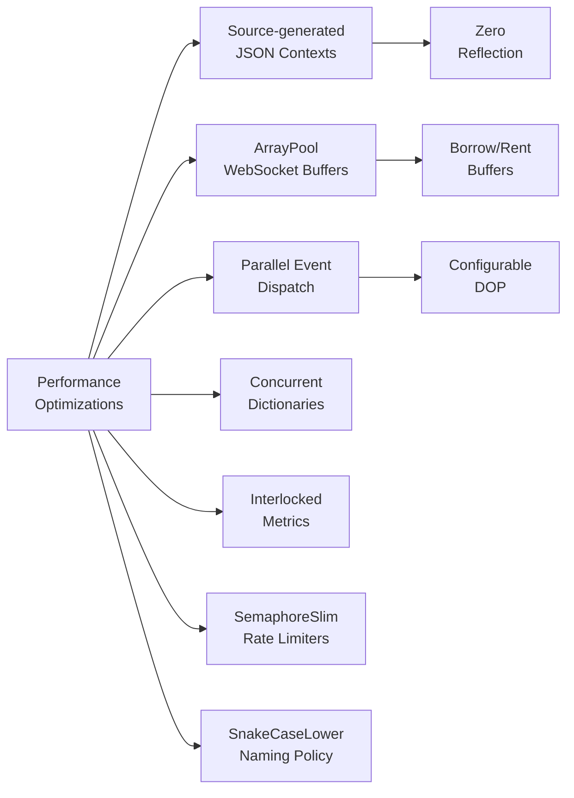

# Performance

PawSharp is designed for high-throughput Discord bots with Native AOT readiness, pooled buffers, parallelized event dispatch, and minimal GC pressure.

---

## Native AOT Readiness

`Directory.Build.props` enables AOT compatibility at the project level:

```xml
<IsAotCompatible>true</IsAotCompatible>
<PublishTrimmed>true</PublishTrimmed>
<TrimMode>link</TrimMode>
```

All JSON serialization uses **source-generated contexts** (`PawSharpJsonContext`, `PawSharpApiJsonContext`) to eliminate reflection:

```csharp
[JsonSerializable(typeof(Guild))]
[JsonSerializable(typeof(Message))]
// ... 80+ types
public partial class PawSharpJsonContext : JsonSerializerContext { }
```

```csharp
private static readonly JsonSerializerOptions _jsonOptions = new()
{
    PropertyNamingPolicy = JsonNamingPolicy.SnakeCaseLower,
    TypeInfoResolver = JsonTypeInfoResolver.Combine(
        PawSharpApiJsonContext.Default,
        PawSharpJsonContext.Default)
};
```

---

## Array Pooling in WebSocket Receive

The `WebSocketConnection` uses `System.Buffers.ArrayPool<byte>` for WebSocket receive buffers to reduce allocations:

```csharp
var buffer = ArrayPool<byte>.Shared.Rent(bufferSize);
try
{
    var result = await webSocket.ReceiveAsync(buffer, ct);
    // process buffer
}
finally
{
    ArrayPool<byte>.Shared.Return(buffer);
}
```

---

## Event Dispatch Parallelism

`EventDispatcher` supports parallel dispatch of events with configurable `MaxDegreeOfParallelism`:

```csharp
_eventDispatcher = new EventDispatcher(
    logger,
    options.EventDispatch.MaxQueueSize,
    options.EventDispatch.EnableParallelDispatch,
    options.EventDispatch.MaxDegreeOfParallelism,  // default: Environment.ProcessorCount
    metrics,
    options.EventDispatch.HandlerTimeoutMs);
```

---

## Object Pooling Patterns

```csharp
// StringBuilder pooling in query building
var qs = new System.Text.StringBuilder();
// reused StringBuilder pattern
```

---

## GC Pressure Reduction

- `MemoryCacheProvider` uses `ConcurrentDictionary` (minimal allocations on lookup)
- `PerformanceMetrics` uses `Interlocked` operations (no lock contention)
- `AdvancedRateLimiter` uses `SemaphoreSlim` (efficient wait/release)
- `GatewaySendAsync` rate limiter uses `SemaphoreSlim(120, 120)` with 60s token bucket
- `LogSanitizer.RedactSensitiveEndpoint` avoids allocations on safe paths

---

## Performance Optimizations



---

## BenchmarkDotNet Benchmarks

Benchmarks live in `tools/Benchmarks/`:

```
dotnet run -c Release -p tools/Benchmarks/
```

Key metrics:
- **REST latency**: request-to-response time
- **Event dispatch**: handler invocation overhead
- **Cache operations**: get/set throughput
- **Serialization**: JSON serialize/deserialize

---

## Configuring Performance Options

```csharp
var options = new PawSharpOptions
{
    EventDispatch = new PawSharpOptions.EventDispatchOptions
    {
        EnableParallelDispatch = true,
        MaxDegreeOfParallelism = 4,
        MaxQueueSize = 100_000,
        HandlerTimeoutMs = 5000
    },
    WebSocketBufferSizeKb = 16,
    EnableCompression = true
};
```

---

## Common Performance Pitfalls

| Pitfall | Impact | Solution |
|---------|--------|----------|
| Blocking in event handlers (`Task.Result`) | Thread pool starvation | Use `async` all the way |
| Heavy CPU work in message handlers | Event queue backup | Offload to background channels |
| String interpolation in log calls | Allocation on every call | Use structured placeholders |
| Disabling array pooling | More GC gen0 collections | Keep default |
| Too many `MaxDegreeOfParallelism` | Racing shared state | Set to `ProcessorCount` |
| Bypassing source-generated JSON | Reflection overhead | Always use `PawSharpJsonContext` |
