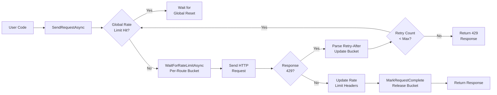

# Rate Limits

Discord enforces rate limits to protect its API. PawSharp's `AdvancedRateLimiter` handles them transparently with per-route bucket tracking, global rate limit synchronization, automatic retry with backoff, and telemetry.

---

## How Discord Rate Limiting Works

Discord uses a **bucket-based** rate limit system:

- Every endpoint belongs to a **bucket** (identified by `X-RateLimit-Bucket` header)
- Each bucket has a **limit** (max requests) and a **reset time**
- After exceeding the limit, requests receive HTTP 429 with a `Retry-After` header
- **Global rate limit** (identified by `X-RateLimit-Global: true`) blocks all requests

```
X-RateLimit-Limit: 5
X-RateLimit-Remaining: 0
X-RateLimit-Reset: 1620000000
X-RateLimit-Bucket: abc123
```

---

## PawSharp's AdvancedRateLimiter Architecture

The `AdvancedRateLimiter` (`src/PawSharp.API/RateLimit/AdvancedRateLimiter.cs`) manages:

- **`ConcurrentDictionary<string, RateLimitBucket>`** - per-route buckets keyed by route or bucket hash
- **`_globalResetAt`** - global rate limit reset timestamp
- **`RateLimitBucket`** - per-bucket `SemaphoreSlim` with remaining count and reset tracking

```csharp
public async Task WaitForRateLimitAsync(string route, string? bucketHash, CancellationToken ct)
{
 if (DateTimeOffset.UtcNow < _globalResetAt)
 {
 var delay = _globalResetAt - DateTimeOffset.UtcNow;
 await Task.Delay(delay, ct);
 }
 var bucket = _buckets.GetOrAdd(bucketHash ?? route, _ => new RateLimitBucket());
 await bucket.WaitAsync(ct);
}
```

### REST Pipeline with Rate Limiter



---

## Per-Route vs Global Rate Limits

### Per-route (bucket) limits

```csharp
// Route: "POST /channels/{channel.id}/messages"
var response = await rest.PostAsync("channels/123/messages", content);
// Rate limiter buckets this by route: "POST /channels/123/messages"
```

### Global rate limit

Set `_globalResetAt` when Discord returns `X-RateLimit-Global: true`:

```csharp
if (HeaderValueIsTrue(response, "X-RateLimit-Global"))
{
 _globalReset = DateTimeOffset.UtcNow.AddSeconds(retryAfterSecs);
}
```

---

## Retry-After Handling

`SendRequestAsync` parses `Retry-After` from headers first, then falls back to the JSON body:

```csharp
private async Task<TimeSpan> GetRetryAfterDelayAsync(HttpResponseMessage response, CancellationToken ct)
{
 if (response.Headers.RetryAfter?.Delta is { } headerDelay && headerDelay > TimeSpan.Zero)
 return headerDelay;

 var body = await response.Content.ReadAsStringAsync(ct);
 using var doc = JsonDocument.Parse(body);
 if (doc.RootElement.TryGetProperty("retry_after", out var ra) && ra.ValueKind == JsonValueKind.Number)
 return TimeSpan.FromSeconds(ra.GetDouble());

 return TimeSpan.FromSeconds(1); // fallback
}
```

---

## Configuring Rate Limit Options

```csharp
var options = new PawSharpOptions
{
 RestApi = new PawSharpOptions.RestApiOptions
 {
 MaxRateLimitRetries = 5,
 ThrowOnApiError = false,
 TimeoutSeconds = 30
 }
};
```

---

## Monitoring Rate Limits

`DiscordRestClient` implements `IRateLimitTelemetrySource`:

```csharp
client.RateLimitObserved += (sender, args) =>
{
 Console.WriteLine($"[RateLimit] {args.Kind} - Route: {args.Route}, Retry: {args.RetryCount}");
};
```

---

## Writing Rate-Limit-Aware Code

### Burst Handling and Backoff

PawSharp handles retries internally. To add your own backoff layer:

```csharp
public async Task<T> WithBackoffAsync<T>(Func<Task<T>> operation, int maxRetries = 5)
{
 var delay = TimeSpan.FromSeconds(1);
 for (int i = 0; i < maxRetries; i++)
 {
 try { return await operation(); }
 catch (RateLimitException)
 {
 if (i == maxRetries - 1) throw;
 await Task.Delay(delay);
 delay = TimeSpan.FromSeconds(delay.TotalSeconds * 2);
 }
 }
 throw new InvalidOperationException("Max retries exceeded");
}
```

### Batch operations with delays

```csharp
// Space out message sends to avoid per-route limits
foreach (var batch in messages.Chunk(5))
{
 var tasks = batch.Select(m => rest.CreateMessageAsync(channelId, m));
 await Task.WhenAll(tasks);
 await Task.Delay(1000); // Inter-batch delay
}
```

---

## Common Mistakes

| Mistake | Solution |
|---------|----------|
| Ignoring `X-RateLimit-Global` header | Let `_rateLimiter.UpdateRateLimits` handle it |
| Reusing `HttpContent` on retry | PawSharp buffers bytes; see `bufferedContentBytes` in `SendRequestAsync` |
| Not configuring `MaxRateLimitRetries` | Default is reasonable; increase for bulk operations |
| Blocking on `WaitForRateLimitAsync` | Always pass `CancellationToken` |
| Disposing `HttpClient` per request | Reuse via `IHttpClientFactory` |
