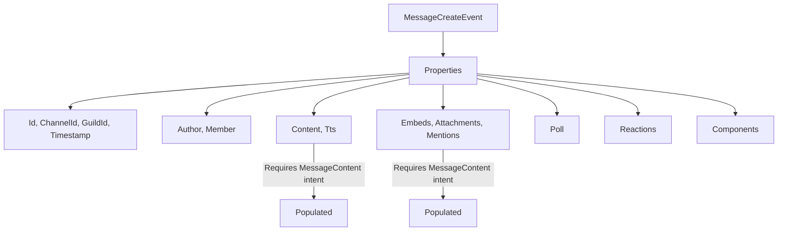
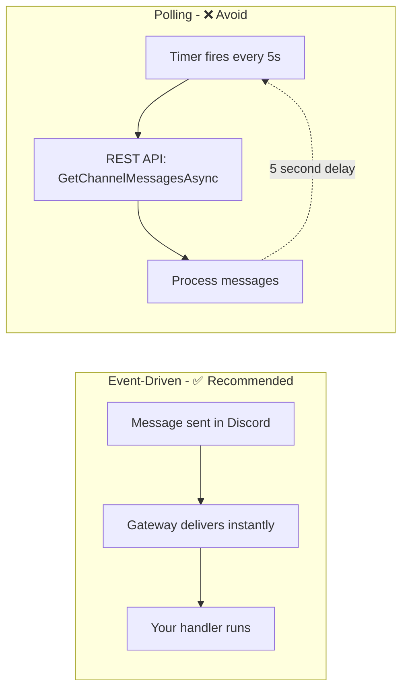

# Receiving Messages

Messages arrive from the Discord Gateway as real-time events. PawSharp dispatches them through the event pipeline as strongly-typed event objects.

---

## Message Events

Three gateway events cover the message lifecycle: create, update, and delete.

### MessageCreateEvent

Fired when a new message is sent in any channel the bot can see.

```csharp
client.OnMessageCreated(async msg =>
{
    Console.WriteLine($"New message from {msg.Author?.Username}: {msg.Content}");
    Console.WriteLine($"Channel ID: {msg.ChannelId}");
    Console.WriteLine($"Message ID: {msg.Id}");

    if (msg.GuildId.HasValue)
        Console.WriteLine($"Guild ID: {msg.GuildId}");

    // Check mentions
    if (msg.MentionEveryone)
        Console.WriteLine("@everyone mentioned!");

    if (msg.Mentions.Any(m => m.Id == client.CurrentUser?.Id))
        Console.WriteLine("Bot was mentioned!");
});
```

### MessageUpdateEvent

Fired when a message is edited. Note that `content` may be `null` if the content didn't change or if the `MessageContent` intent is missing.

```csharp
client.OnMessageUpdated(async msg =>
{
    Console.WriteLine($"Message {msg.Id} updated");

    // Content is null if only embeds/attachments changed
    if (msg.Content != null)
        Console.WriteLine($"New content: {msg.Content}");

    // Check if embeds were added/removed
    if (msg.Embeds?.Count > 0)
        Console.WriteLine($"Embeds: {msg.Embeds.Count}");

    // Check component changes
    if (msg.Components?.Count > 0)
        Console.WriteLine($"Components updated");
});
```

### MessageDeleteEvent

Fired when a single message is deleted. Only contains the `Id`, `ChannelId`, and optionally `GuildId`.

```csharp
client.OnMessageDeleted(async msg =>
{
    Console.WriteLine($"Message {msg.Id} deleted in channel {msg.ChannelId}");

    // Check cache if you stored the message content before deletion
    if (_messageCache.TryRemove(msg.Id, out var cached))
        Console.WriteLine($"Deleted content was: {cached.Content}");
});
```

### MessageDeleteBulkEvent

Fired when multiple messages are deleted at once (e.g., by a moderator or auto-cleanup).

```csharp
client.OnMessagesBulkDeleted(async bulk =>
{
    Console.WriteLine($"{bulk.Ids.Count} messages deleted in channel {bulk.ChannelId}");
    Console.WriteLine($"Deleted IDs: {string.Join(", ", bulk.Ids.Take(5))}...");

    // Clean up cached messages
    foreach (var id in bulk.Ids)
        _messageCache.TryRemove(id, out _);
});
```

### Complete Message Event Properties

```csharp
client.OnMessageCreated(async msg =>
{
    // Convert to Message entity for full access
    Message message = msg.ToMessage();

    Console.WriteLine($"ID: {message.Id}");
    Console.WriteLine($"Channel: {message.ChannelId}");
    Console.WriteLine($"Author: {message.Author?.Username}#{message.Author?.Discriminator}");
    Console.WriteLine($"Content: {message.Content}");
    Console.WriteLine($"Timestamp: {message.Timestamp}");
    Console.WriteLine($"Edited: {message.EditedTimestamp}");
    Console.WriteLine($"TTS: {message.Tts}");
    Console.WriteLine($"Pinned: {message.Pinned}");
    Console.WriteLine($"Type: {message.Type}");

    // Attachments
    foreach (var attachment in message.Attachments)
        Console.WriteLine($"Attachment: {attachment.Filename} ({attachment.Url})");

    // Embeds
    foreach (var embed in message.Embeds)
        Console.WriteLine($"Embed: {embed.Title}");

    // Mentions
    Console.WriteLine($"Mentions: {message.Mentions.Count} users");
    Console.WriteLine($"Mentioned roles: {message.MentionRoles.Count}");

    // Poll
    if (message.Poll != null)
        Console.WriteLine($"Poll: {message.Poll.Question}");
});
```

---

## Message Content Intent Requirement

Since August 31, 2022, Discord requires the **Message Content intent** to receive message content, embeds, attachments, and mentions in:

- `MESSAGE_CREATE`
- `MESSAGE_UPDATE`

Without it, `msg.Content` is always `""`, `msg.Embeds` is empty, `msg.Attachments` is empty, and `msg.Mentions` is empty.

```csharp
// You MUST enable this both in code AND in the Developer Portal
var options = new PawSharpOptions
{
    Token = token,
    Intents = GatewayIntents.GuildMessages
            | GatewayIntents.DirectMessages
            | GatewayIntents.MessageContent,  // PRIVILEGED
};
```

> ⚠️ **Warning:** The `MessageContent` intent is **privileged**. You must enable it at https://discord.com/developers/applications —> Your App —> Bot —> "Message Content Intent". Setting it in code alone is not sufficient.

### What Works Without MessageContent Intent

```csharp
// These still work without MessageContent intent:
client.OnMessageCreated(msg =>
{
    Console.WriteLine(msg.Id);             // ✅ Always available
    Console.WriteLine(msg.ChannelId);      // ✅ Always available
    Console.WriteLine(msg.Author?.Id);     // ✅ Always available
    Console.WriteLine(msg.Timestamp);      // ✅ Always available
    Console.WriteLine(msg.GuildId);        // ✅ Always available
    Console.WriteLine(msg.Member);         // ✅ Always available
    Console.WriteLine(msg.Tts);            // ✅ Always available
    Console.WriteLine(msg.MentionEveryone); // ✅ Always available
    Console.WriteLine(msg.Poll);           // ✅ Always available (poll content)

    Console.WriteLine(msg.Content);        // ❌ Always ""
    Console.WriteLine(msg.Embeds.Count);   // ❌ Always 0
    Console.WriteLine(msg.Attachments.Count); // ❌ Always 0
    Console.WriteLine(msg.Mentions.Count); // ❌ Always 0
});
```

---

## Working with Message Properties



### Channel ID Parsing

```csharp
client.OnMessageCreated(msg =>
{
    // All IDs are ulong (snowflakes)
    ulong channelId = msg.ChannelId;
    ulong? guildId = msg.GuildId;

    // Use the MessageReference to trace replies
    // msg.MessageReference is available on the Message entity from ToMessage()
    Message fullMsg = msg.ToMessage();
    if (fullMsg.MessageReference != null)
    {
        Console.WriteLine($"Reply to message: {fullMsg.MessageReference.MessageId}");
        Console.WriteLine($"In channel: {fullMsg.MessageReference.ChannelId}");
    }
});
```

### Author vs Member

```csharp
client.OnMessageCreated(msg =>
{
    // Author is always present (minimal user info)
    Console.WriteLine($"Author: {msg.Author?.Username}");

    // Member includes guild-specific data (nickname, roles)
    // Only present in guild channels
    if (msg.Member != null)
    {
        Console.WriteLine($"Nickname: {msg.Member.Nick}");
        Console.WriteLine($"Roles: {string.Join(", ", msg.Member.Roles)}");
        Console.WriteLine($"Joined: {msg.Member.JoinedAt}");
    }
});
```

---

## Message Caching

PawSharp provides an `IEntityCache` that automatically caches messages from gateway events when the `CacheManager` is wired up (default in DI setup).

```csharp
// Automatic caching (enabled by default in DI)
// cache.SubscribeToGateway(gatewayClient) wires it up

// Access the cache
IEntityCache cache = client.Cache;

// Messages are cached automatically from MESSAGE_CREATE events
Message? cached = cache.GetMessage(channelId, messageId);

// Check if a message is cached
bool exists = cache.HasMessage(channelId, messageId);

// Custom caching in event handlers
private readonly ConcurrentDictionary<ulong, MessageCreateEvent> _lastMessages = new();

client.OnMessageCreated(msg =>
{
    // Keep last 100 messages per channel
    _lastMessages[msg.ChannelId] = msg;

    if (_lastMessages.Count > 100)
    {
        var oldest = _lastMessages.Keys.First();
        _lastMessages.TryRemove(oldest, out _);
    }
});

client.OnMessageDeleted(async msg =>
{
    // Remove from cache when deleted
    _lastMessages.TryRemove(msg.ChannelId, out _);
});
```

> 💡 **Tip:** For production bots, use the built-in `IEntityCache` rather than rolling your own. It's optimized, thread-safe, and handles cache invalidation.

---

## Polling vs Event-Driven



### Event-Driven (Recommended)

```csharp
// Instant delivery via gateway
client.OnMessageCreated(msg =>
{
    // Fires within milliseconds of the message being sent
    Console.WriteLine(msg.Content);
});
```

### Polling (Discouraged)

```csharp
// BAD: Polling the REST API for new messages
private ulong _lastMessageId;

public async Task PollMessagesAsync(ulong channelId)
{
    while (!_cts.Token.IsCancellationRequested)
    {
        var messages = await client.GetChannelMessagesAsync(
            channelId, limit: 10, after: _lastMessageId);

        if (messages?.Count > 0)
        {
            _lastMessageId = messages.Max(m => m.Id);
            foreach (var msg in messages)
                await ProcessMessageAsync(msg);
        }

        await Task.Delay(5000, _cts.Token);  // 5 second delay!
    }
}
```

> ❌ **Never use polling** for message reception. The Gateway delivers messages in real-time with no delay and no rate limit cost.

---

## Best Practices for Message Handling

### ✅ Filter Bot Messages Early

```csharp
client.OnMessageCreated(msg =>
{
    if (msg.Author?.IsBot == true) return;  // Skip bots early

    // Your logic here
});
```

### ✅ Use Switch Expression for Command Routing

```csharp
client.OnMessageCreated(async msg =>
{
    if (msg.Author?.IsBot || string.IsNullOrEmpty(msg.Content)) return;

    var command = msg.Content.Split(' ')[0].ToLowerInvariant();

    switch (command)
    {
        case "!ping":
            await client.ReplyAsync(msg, "Pong!");
            break;
        case "!help":
            await ShowHelpAsync(msg.ChannelId);
            break;
        case "!info":
            await ShowInfoAsync(msg);
            break;
        default:
            // Unknown command — ignore or send help hint
            break;
    }
});
```

### ✅ Use TryReply/Safe Helpers

```csharp
client.OnMessageCreated(async msg =>
{
    // TryReplyAsync returns null on failure instead of throwing
    var reply = await client.TryReplyAsync(msg, "Processing...");
    if (reply == null)
    {
        _logger.LogWarning("Could not reply to {MessageId}", msg.Id);
        return;
    }

    try
    {
        var result = await ProcessMessageAsync(msg);
        await client.EditMessageAsync(reply.ChannelId, reply.Id, result);
    }
    catch (Exception ex)
    {
        _logger.LogError(ex, "Failed to process {MessageId}", msg.Id);
        await client.EditMessageAsync(reply.ChannelId, reply.Id, "Processing failed.");
    }
});
```

### ❌ Avoid Blocking Operations

```csharp
// BAD
client.OnMessageCreated(msg =>
{
    Task.Delay(1000).Wait();  // Blocks the gateway receive loop!
    Thread.Sleep(500);        // BAD!
});

// GOOD
client.OnMessageCreated(async msg =>
{
    await Task.Delay(1000);
    await ProcessAsync(msg);
});
```

### ✅ Offload Heavy Processing

```csharp
private readonly Channel<Func<Task>> _workQueue =
    System.Threading.Channels.Channel.CreateUnbounded<Func<Task>>();

public BotHost()
{
    // Background processor
    _ = Task.Run(async () =>
    {
        await foreach (var work in _workQueue.Reader.ReadAllAsync())
        {
            try { await work(); }
            catch (Exception ex) { _logger.LogError(ex, "Background task failed"); }
        }
    });
}

client.OnMessageCreated(msg =>
{
    // Enqueue heavy work — handler returns immediately
    _workQueue.Writer.TryWrite(() => ProcessMessageAsync(msg));
});
```

### ✅ Handle Message Updates for Link Previews

```csharp
client.OnMessageUpdated(msg =>
{
    // Discord may send updates when link previews generate
    // Content will be null if only embeds changed
    if (msg.Content == null && msg.Embeds?.Count > 0)
    {
        Console.WriteLine($"Message {msg.Id} received embed preview");
    }

    // Messages can be updated multiple times
    // Each update may have partial data
});
```

---

## Complete Example — Moderation Bot

```csharp
public class MessageHandler
{
    private readonly DiscordClient _client;
    private readonly ILogger<MessageHandler> _logger;
    private readonly ConcurrentDictionary<ulong, int> _warningCount = new();

    public MessageHandler(DiscordClient client, ILogger<MessageHandler> logger)
    {
        _client = client;
        _logger = logger;
    }

    public IDisposable Subscribe()
    {
        var subs = new CompositeDisposable(
            _client.OnMessageCreated(OnMessageCreated),
            _client.OnMessageUpdated(OnMessageUpdated),
            _client.OnMessageDeleted(OnMessageDeleted),
            _client.OnMessagesBulkDeleted(OnBulkDelete)
        );
        return subs;
    }

    private async Task OnMessageCreated(MessageCreateEvent msg)
    {
        if (msg.Author?.IsBot == true) return;

        _logger.LogInformation(
            "Message from {User} in {Channel}: {Content}",
            msg.Author.Username, msg.ChannelId, msg.Content);

        // Check for spam (3+ messages in 5 seconds)
        if (IsSpam(msg.Author.Id))
        {
            await _client.DeleteMessageAsync(msg.ChannelId, msg.Id);
            var warning = await _client.ReplyAsync(msg,
                $"{msg.Author.Mention} Please don't spam.");

            _logger.LogWarning("Spam detected from {User}", msg.Author.Id);
        }
    }

    private bool IsSpam(ulong userId)
    {
        var count = _warningCount.AddOrUpdate(userId, 1, (_, c) => c + 1);
        _ = Task.Delay(5000).ContinueWith(_ =>
            _warningCount.TryUpdate(userId, count - 1, count));
        return count > 3;
    }

    private Task OnMessageUpdated(MessageUpdateEvent msg)
    {
        if (msg.Content != null)
            _logger.LogInformation("Message {Id} edited: {Content}", msg.Id, msg.Content);
        return Task.CompletedTask;
    }

    private async Task OnMessageDeleted(MessageDeleteEvent msg)
    {
        _logger.LogInformation("Message {Id} deleted in channel {Channel}", msg.Id, msg.ChannelId);

        // Log deleted messages for audit
        if (_client.Cache.GetMessage(msg.ChannelId, msg.Id) is Message cached)
        {
            var logChannel = 123456789012345678UL; // Your audit log channel
            await _client.SendMessageAsync(logChannel,
                $"Message deleted in <#{msg.ChannelId}> by {cached.Author?.Username}: " +
                $"```{cached.Content}```");
        }
    }

    private async Task OnBulkDelete(MessageDeleteBulkEvent bulk)
    {
        _logger.LogInformation("{Count} messages bulk-deleted in {Channel}",
            bulk.Ids.Count, bulk.ChannelId);

        // Clean up any in-memory tracking
        foreach (var id in bulk.Ids)
            _warningCount.TryRemove(id, out _);
    }
}

// Composite disposable for batch cleanup
public class CompositeDisposable : IDisposable
{
    private readonly List<IDisposable> _disposables;
    public CompositeDisposable(params IDisposable[] disposables)
        => _disposables = new List<IDisposable>(disposables);
    public void Dispose()
    {
        foreach (var d in _disposables) d.Dispose();
    }
}
```

---

## Related Guides

- [Sending Messages](./sending-messages.md) — How to send, edit, and delete messages
- [Events](./events.md) — Event system architecture and all event types
- [Gateway Connection](./gateway.md) — Connection lifecycle and intents
- [Slash Commands](./slash-commands.md) — Modern interaction-based command system
