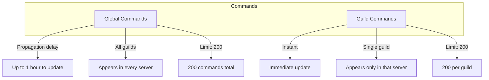
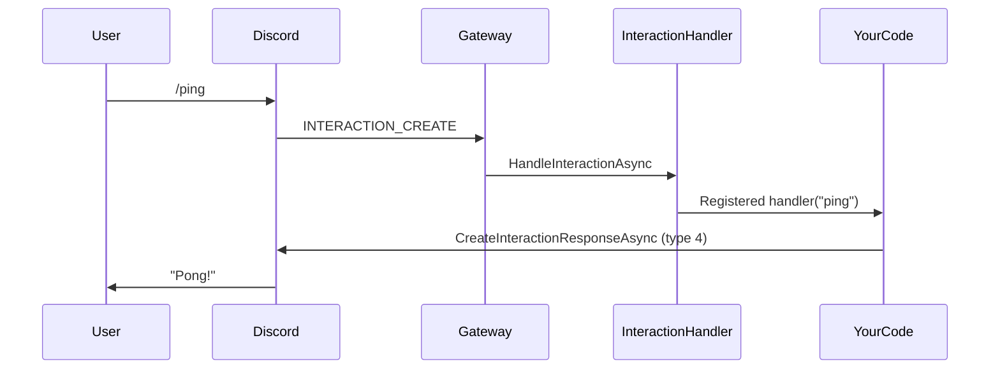
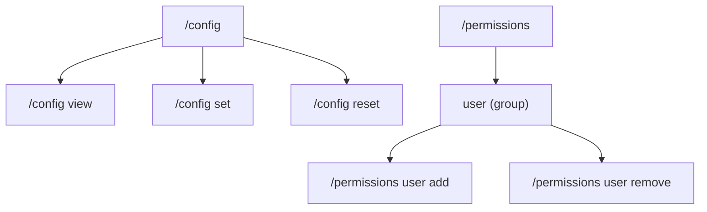

# Slash Commands

Slash commands are Discord's modern interaction system. Users type `/` to see available commands, required options, and descriptions — no prefix required.

---

## Global vs Guild Commands



| Aspect | Global | Guild |
|--------|--------|-------|
| Scope | All guilds the bot is in | A single guild |
| Update propagation | Up to 1 hour | Instant |
| Use for | Stable, general-purpose commands | Testing, moderation, per-guild config |
| Max commands | 200 | 200 per guild |

### When to Use Each

- **Use guild commands during development** — instant updates mean you can iterate quickly.
- **Promote to global commands** when your bot is ready for production.
- **Use `BulkOverwrite` for initialization** — it replaces all commands atomically.

---

## Building Commands with SlashCommandBuilder

The `SlashCommandBuilder` provides a fluent API for constructing commands.

```csharp
using PawSharp.Interactions.Builders;

var command = new SlashCommandBuilder("ping", "Responds with pong")
    .SetDmPermission(true)
    .SetNsfw(false)
    .Build();
```

### Full Builder Example

```csharp
var greetCommand = new SlashCommandBuilder("greet", "Greet a user")
    .AddStringOption("message", "A custom greeting", required: false)
    .AddUserOption("user", "The user to greet", required: true)
    .SetDefaultMemberPermissions(Permissions.SendMessages)
    .SetDmPermission(false)
    .Build();
```

### Available Option Types

```csharp
new SlashCommandBuilder("configure", "Configure the bot")
    .AddStringOption("key", "Setting name", required: true)
    .AddStringOption("value", "Setting value", required: true)
    .AddIntegerOption("count", "How many", minValue: 1, maxValue: 100)
    .AddBooleanOption("enabled", "Whether enabled")
    .AddUserOption("target", "A user")
    .AddChannelOption("channel", "A channel")
    .AddRoleOption("role", "A role")
    .AddMentionableOption("mentionable", "A user or role")
    .AddNumberOption("amount", "A decimal number", minValue: 0.5, maxValue: 99.9)
    .AddAttachmentOption("file", "A file attachment");
```

### Option Type Reference

| Builder Method | Discord Type | .NET Type |
|---------------|-------------|-----------|
| `AddStringOption` | `STRING` | `string` |
| `AddIntegerOption` | `INTEGER` | `long` |
| `AddBooleanOption` | `BOOLEAN` | `bool` |
| `AddUserOption` | `USER` | `ulong` (snowflake) |
| `AddChannelOption` | `CHANNEL` | `ulong` (snowflake) |
| `AddRoleOption` | `ROLE` | `ulong` (snowflake) |
| `AddMentionableOption` | `MENTIONABLE` | `ulong` (snowflake) |
| `AddNumberOption` | `NUMBER` | `double` |
| `AddAttachmentOption` | `ATTACHMENT` | `ulong` (snowflake) |

---

## Registering Commands

### Register a Global Command

```csharp
var appId = client.CurrentUser!.Id;

var request = new SlashCommandBuilder("ping", "Responds with pong")
    .ToCreateApplicationCommandRequest();

var created = await client.Rest.CreateGlobalApplicationCommandAsync(appId, request);
Console.WriteLine($"Created command: {created?.Name} (ID: {created?.Id})");
```

### Register a Guild Command

```csharp
var appId = client.CurrentUser!.Id;
ulong guildId = 123456789012345678;

var request = new SlashCommandBuilder("reload", "Reload bot configuration (admin only)")
    .SetDefaultMemberPermissions(Permissions.Administrator)
    .ToCreateApplicationCommandRequest();

await client.Rest.CreateGuildApplicationCommandAsync(appId, guildId, request);
Console.WriteLine($"Created guild command for {guildId}");
```

### Bulk Overwrite (Replace All Commands)

```csharp
var appId = client.CurrentUser!.Id;
ulong testGuildId = 123456789012345678;

var commands = new List<CreateApplicationCommandRequest>
{
    new SlashCommandBuilder("ping", "Pong!").ToCreateApplicationCommandRequest(),
    new SlashCommandBuilder("echo", "Repeat a message")
        .AddStringOption("text", "Text to repeat", required: true)
        .ToCreateApplicationCommandRequest(),
    new SlashCommandBuilder("info", "Show bot info")
        .ToCreateApplicationCommandRequest(),
};

// Guild-level — instant updates (use during development)
await client.Rest.BulkOverwriteGuildApplicationCommandsAsync(appId, testGuildId, commands);

// Global — can take up to 1 hour to propagate
await client.Rest.BulkOverwriteGlobalApplicationCommandsAsync(appId, commands);
```

> 💡 **Tip:** Use `BulkOverwriteGuildApplicationCommandsAsync` during development. It atomically replaces all guild commands, making it easy to reset your command list.

> ⚠️ **Warning:** `BulkOverwriteGlobalApplicationCommandsAsync` completely replaces **all** global commands for your application. Be careful — it cannot be rolled back instantly.

---

## Handling Command Execution

When a user runs a slash command, Discord sends an `INTERACTION_CREATE` event. PawSharp routes it through the `InteractionHandler`.

### Command Dispatch Flow



### Registering Handlers

```csharp
// Register handlers before connecting
client.Interactions.RegisterCommand("ping", async interaction =>
{
    await client.Interactions.RespondAsync(
        interaction.Id,
        interaction.Token,
        "Pong!");
});

// Must happen before client.ConnectAsync()
await client.ConnectAsync();
```

### Reading Option Values

```csharp
client.Interactions.RegisterCommand("greet", async interaction =>
{
    var userOption = interaction.Data?.Options?
        .FirstOrDefault(o => o.Name == "user");
    var messageOption = interaction.Data?.Options?
        .FirstOrDefault(o => o.Name == "message");

    ulong userId = 0;
    string message = "Hello!";

    if (userOption?.Value != null)
        userId = ulong.Parse(userOption.Value.ToString()!);

    if (messageOption?.Value != null)
        message = messageOption.Value.ToString()!;

    await client.Interactions.RespondAsync(
        interaction.Id,
        interaction.Token,
        $"{message} <@{userId}>");
});
```

### Accessing Resolved Data

For USER, CHANNEL, ROLE, and MENTIONABLE options, Discord includes resolved objects (user details, channel metadata, etc.).

```csharp
client.Interactions.RegisterCommand("userinfo", async interaction =>
{
    var userOption = interaction.Data?.Options?.FirstOrDefault(o => o.Name == "user");
    if (userOption?.Value == null) return;

    ulong userId = ulong.Parse(userOption.Value.ToString()!);

    // Resolved data includes full user info
    var resolvedUser = interaction.Data?.Resolved?.Users?.GetValueOrDefault(userId);

    if (resolvedUser != null)
    {
        var embed = new EmbedBuilder()
            .WithTitle(resolvedUser.Username)
            .WithDescription($"ID: {resolvedUser.Id}")
            .AddField("Bot", resolvedUser.IsBot ? "Yes" : "No", true)
            .AddField("Created", resolvedUser.CreatedAt?.ToString("yyyy-MM-dd") ?? "Unknown", true)
            .WithThumbnail(resolvedUser.GetAvatarUrl())
            .Build();

        await client.Interactions.RespondWithEmbedsAsync(
            interaction.Id, interaction.Token,
            "", new List<Embed> { embed });
    }
});
```

---

## Subcommands and Subcommand Groups

Subcommands organize complex commands into logical groups.



### Building Subcommands

```csharp
var configCommand = new SlashCommandBuilder("config", "Configure the bot")
    .AddSubcommand("view", "View current configuration")
    .AddSubcommand("set", "Set a configuration value")
        // Options under subcommand
        .AddStringOption("key", "Setting name", required: true)
        .AddStringOption("value", "Setting value", required: true)
    .AddSubcommand("reset", "Reset configuration to defaults")
    .Build();
```

### Building Subcommand Groups

```csharp
var permissionsCommand = new SlashCommandBuilder("permissions", "Manage permissions")
    .AddSubcommandGroup("user", "Manage user permissions")
        // Subcommand group requires nested subcommands
    // Note: SlashCommandBuilder doesn't directly nest options under groups
    // Build manually for complex subcommand groups:
    .Build();

// For full subcommand group support, construct the request manually:
var groupRequest = new CreateApplicationCommandRequest
{
    Name = "permissions",
    Description = "Manage permissions",
    Type = (int)ApplicationCommandType.ChatInput,
    Options = new List<ApplicationCommandOption>
    {
        new()
        {
            Type = ApplicationCommandOptionType.SubCommandGroup,
            Name = "user",
            Description = "Manage user permissions",
            Options = new List<ApplicationCommandOption>
            {
                new()
                {
                    Type = ApplicationCommandOptionType.SubCommand,
                    Name = "add",
                    Description = "Add a permission to a user",
                    Options = new List<ApplicationCommandOption>
                    {
                        new()
                        {
                            Type = ApplicationCommandOptionType.User,
                            Name = "user",
                            Description = "The user",
                            Required = true,
                        },
                    },
                },
                new()
                {
                    Type = ApplicationCommandOptionType.SubCommand,
                    Name = "remove",
                    Description = "Remove a permission from a user",
                    Options = new List<ApplicationCommandOption>
                    {
                        new()
                        {
                            Type = ApplicationCommandOptionType.User,
                            Name = "user",
                            Description = "The user",
                            Required = true,
                        },
                    },
                },
            },
        },
    },
};
```

### Handling Subcommands

```csharp
client.Interactions.RegisterCommand("config", async interaction =>
{
    var options = interaction.Data?.Options;
    if (options == null || options.Count == 0) return;

    var subcommand = options[0];  // The subcommand

    switch (subcommand.Name)
    {
        case "view":
            await client.Interactions.RespondAsync(
                interaction.Id, interaction.Token,
                "Current config: ...");
            break;

        case "set":
            var key = subcommand.Options?.FirstOrDefault(o => o.Name == "key")?.Value;
            var value = subcommand.Options?.FirstOrDefault(o => o.Name == "value")?.Value;
            await client.Interactions.RespondAsync(
                interaction.Id, interaction.Token,
                $"Set {key} = {value}");
            break;

        case "reset":
            await client.Interactions.RespondAsync(
                interaction.Id, interaction.Token,
                "Config reset to defaults.");
            break;
    }
});

// Or use the dedicated subcommand handler registration
client.Interactions.OnSubCommand("", "view", "config", async interaction =>
{
    await client.Interactions.RespondAsync(
        interaction.Id, interaction.Token,
        "Current config: ...");
});
```

---

## Autocomplete

For string and integer options with `autocomplete: true`, your bot can provide dynamic suggestions.

### Registering an Autocomplete Command

```csharp
var command = new SlashCommandBuilder("search", "Search the database")
    .AddStringOption("query", "Search query", required: true, autocomplete: true)
    .Build();

await client.Rest.CreateGlobalApplicationCommandAsync(appId, command.ToCreateApplicationCommandRequest());
```

### Handling Autocomplete

```csharp
client.Interactions.RegisterAutocomplete("search", async interaction =>
{
    var focusedOption = interaction.Data?.Options?
        .FirstOrDefault(o => o.Focused == true);

    if (focusedOption == null || focusedOption.Value == null)
        return new List<AutocompleteChoice>();

    var query = focusedOption.Value.ToString()!.ToLowerInvariant();

    // Fetch results from your data source
    var results = await _database.SearchAsync(query);

    // Return up to 25 choices
    return results.Take(25).Select(r => new AutocompleteChoice
    {
        Name = r.DisplayName,
        Value = r.Id,
    }).ToList();
});
```

> 💡 **Tip:** Autocomplete handlers must respond within 3 seconds. PawSharp automatically sends the response for you — just return the choice list.

---

## Permissions and Contexts

### Default Member Permissions

Restrict commands to users with specific permissions:

```csharp
// Only users with Administrator permission can see/use this command
var banCommand = new SlashCommandBuilder("ban", "Ban a user")
    .SetDefaultMemberPermissions(Permissions.BanMembers)
    .AddUserOption("user", "User to ban", required: true)
    .AddStringOption("reason", "Ban reason")
    .Build();
```

### DM Permission

```csharp
// Allow command in DMs
var helpCommand = new SlashCommandBuilder("help", "Get help")
    .SetDmPermission(true)
    .Build();

// Restrict to guilds only (default for most moderation commands)
var kickCommand = new SlashCommandBuilder("kick", "Kick a user")
    .SetDmPermission(false)
    .Build();
```

### Command Contexts

Specify where a command can be used:

```csharp
// Using the raw request for full control
var commandRequest = new CreateApplicationCommandRequest
{
    Name = "report",
    Description = "Report an issue",
    Contexts = new List<int>
    {
        (int)InteractionContextType.Guild,       // 0 - In servers
        (int)InteractionContextType.PrivateChannel, // 1 - In DMs
        // 2 - Private channels not included
    },
    IntegrationTypes = new List<int>
    {
        (int)ApplicationIntegrationType.GuildInstall,     // 0
        (int)ApplicationIntegrationType.UserInstall,      // 1
    },
};
```

### Checking Permissions in Handlers

```csharp
client.Interactions.RegisterCommand("slowmode", async interaction =>
{
    // Check channel-level permission in handler
    var member = interaction.Member;
    if (member == null || !member.Roles.Contains(adminRoleId))
    {
        await client.Interactions.RespondEphemeralAsync(
            interaction.Id, interaction.Token,
            "You don't have permission to use this command.");
        return;
    }

    var duration = interaction.Data?.Options?
        .FirstOrDefault(o => o.Name == "duration")?.Value;

    await _channelService.SetSlowmodeAsync(interaction.ChannelId, int.Parse(duration!.ToString()!));
    await client.Interactions.RespondAsync(
        interaction.Id, interaction.Token,
        $"Slowmode set to {duration} seconds.");
});
```

---

## Complete Example — Full Command System

```csharp
using PawSharp.Interactions.Builders;
using PawSharp.Core.Builders;

public class CommandRegistrationService
{
    private readonly DiscordClient _client;
    private readonly ulong _appId;
    private readonly ulong _devGuildId;

    public CommandRegistrationService(DiscordClient client, ulong devGuildId)
    {
        _client = client;
        _appId = client.CurrentUser!.Id;
        _devGuildId = devGuildId;
    }

    public async Task RegisterCommandsAsync()
    {
        var guildCommands = new List<CreateApplicationCommandRequest>
        {
            // /ping
            new SlashCommandBuilder("ping", "Responds with pong")
                .ToCreateApplicationCommandRequest(),

            // /echo <text> [ephemeral]
            new SlashCommandBuilder("echo", "Repeat your message")
                .AddStringOption("text", "Text to repeat", required: true)
                .AddBooleanOption("ephemeral", "Only show to you")
                .ToCreateApplicationCommandRequest(),

            // /userinfo <user>
            new SlashCommandBuilder("userinfo", "Get info about a user")
                .AddUserOption("user", "The user", required: true)
                .ToCreateApplicationCommandRequest(),

            // /kick <user> [reason]
            new SlashCommandBuilder("kick", "Kick a user")
                .SetDefaultMemberPermissions(Permissions.KickMembers)
                .AddUserOption("user", "User to kick", required: true)
                .AddStringOption("reason", "Reason for the kick")
                .ToCreateApplicationCommandRequest(),
        };

        // Register guild commands (instant — for development)
        await _client.Rest.BulkOverwriteGuildApplicationCommandsAsync(
            _appId, _devGuildId, guildCommands);

        Console.WriteLine($"Registered {guildCommands.Count} guild commands");
    }

    public void RegisterHandlers()
    {
        // /ping
        _client.Interactions.RegisterCommand("ping", async interaction =>
        {
            var latency = _client.Gateway.LastHeartbeatLatency;
            var ms = latency?.TotalMilliseconds ?? 0;

            await _client.Interactions.RespondAsync(
                interaction.Id, interaction.Token,
                $"Pong! Heartbeat latency: {ms:F0}ms");
        });

        // /echo
        _client.Interactions.RegisterCommand("echo", async interaction =>
        {
            var text = interaction.Data?.Options?
                .FirstOrDefault(o => o.Name == "text")?.Value?.ToString() ?? "";
            var ephemeral = interaction.Data?.Options?
                .FirstOrDefault(o => o.Name == "ephemeral")?.Value?.ToString() == "true";

            await _client.Interactions.RespondAsync(
                interaction.Id, interaction.Token,
                text, ephemeral);
        });

        // /userinfo
        _client.Interactions.RegisterCommand("userinfo", async interaction =>
        {
            var userOption = interaction.Data?.Options?
                .FirstOrDefault(o => o.Name == "user");

            if (userOption?.Value == null) return;

            var userId = ulong.Parse(userOption.Value.ToString()!);
            var resolvedUser = interaction.Data?.Resolved?.Users?.GetValueOrDefault(userId);

            if (resolvedUser == null) return;

            var embed = new EmbedBuilder()
                .WithTitle(resolvedUser.Username)
                .WithColor(0x5865F2)
                .AddField("User ID", resolvedUser.Id.ToString(), true)
                .AddField("Bot", resolvedUser.IsBot ? "Yes" : "No", true)
                .AddField("Account Created",
                    resolvedUser.CreatedAt?.ToString("yyyy-MM-dd") ?? "Unknown", true)
                .WithTimestamp()
                .Build();

            await _client.Interactions.RespondWithEmbedsAsync(
                interaction.Id, interaction.Token,
                "", new List<Embed> { embed });
        });

        // /kick
        _client.Interactions.RegisterCommand("kick", async interaction =>
        {
            var userOption = interaction.Data?.Options?
                .FirstOrDefault(o => o.Name == "user");
            var reasonOption = interaction.Data?.Options?
                .FirstOrDefault(o => o.Name == "reason");

            if (userOption?.Value == null) return;

            var targetId = ulong.Parse(userOption.Value.ToString()!);
            var reason = reasonOption?.Value?.ToString();

            var success = await _client.RemoveGuildMemberAsync(
                interaction.GuildId!.Value, targetId,
                reason: reason);

            if (success)
            {
                await _client.Interactions.RespondAsync(
                    interaction.Id, interaction.Token,
                    $"Kicked <@{targetId}>{(reason != null ? $" — {reason}" : "")}");
            }
            else
            {
                await _client.Interactions.RespondEphemeralAsync(
                    interaction.Id, interaction.Token,
                    "Failed to kick user. Check my permissions.");
            }
        });
    }
}
```

---

## Deferring and Editing Responses

Some commands take longer than Discord's 3-second response window. Use deferring to acknowledge the interaction, then edit the response later.

```csharp
client.Interactions.RegisterCommand("report", async interaction =>
{
    // Defer — shows "Bot is thinking..." for up to 15 minutes
    await _client.Interactions.DeferAsync(interaction.Id, interaction.Token);

    // Do long work
    var report = await GenerateReportAsync(interaction);

    // Edit the deferred response
    await _client.Interactions.EditResponseAsync(
        interaction.ApplicationId.ToString(),
        interaction.Token,
        new EditMessageRequest
        {
            Content = report,
        });
});
```

### Follow-up Messages

```csharp
client.Interactions.RegisterCommand("poll", async interaction =>
{
    await _client.Interactions.DeferAsync(interaction.Id, interaction.Token);

    // Send multiple follow-ups
    var results = await RunPollAsync();
    var count = 0;

    foreach (var result in results)
    {
        await _client.Interactions.CreateFollowupAsync(
            interaction.ApplicationId.ToString(),
            interaction.Token,
            new CreateMessageRequest { Content = $"Round {++count}: {result}" });
    }
});
```

---

## Common Mistakes

### ❌ Registering Handlers After Connect

```csharp
await client.ConnectAsync();

// Handler never fires — the interaction was already missed
client.Interactions.RegisterCommand("ping", async interaction => { ... });
```

> ✅ **Correct:** Register handlers **before** connecting.

### ❌ Forgetting to Respond Within 3 Seconds

```csharp
client.Interactions.RegisterCommand("slow", async interaction =>
{
    // Takes 10 seconds — interaction will fail
    await Task.Delay(10000);
    await client.Interactions.RespondAsync(interaction.Id, interaction.Token, "Done");
});
```

> ✅ **Correct:** Use `DeferAsync()` for long-running commands.

### ❌ Missing Intent for Interactions

The `Guilds` intent is required for interaction events. Without it, `INTERACTION_CREATE` will never fire.

```csharp
var options = new PawSharpOptions
{
    Token = token,
    Intents = GatewayIntents.Guilds  // Required for slash commands
            | GatewayIntents.GuildMessages,
};
```

### ❌ Not Using Guild Commands During Development

```csharp
// BAD: Registering global commands during development
// Takes up to 1 hour to update
await client.Rest.CreateGlobalApplicationCommandAsync(appId, request);

// GOOD: Use guild commands for instant updates
await client.Rest.CreateGuildApplicationCommandAsync(appId, guildId, request);
```

---

## Best Practices Summary

| Practice | Reason |
|----------|--------|
| ✅ Use guild commands during development | Instant updates, no caching delay |
| ✅ Register handlers before `ConnectAsync()` | Ensures no interactions are missed |
| ✅ Defer long-running operations > 2s | Avoids 3-second interaction timeout |
| ✅ Use `RespondEphemeralAsync` for confirmations | Reduces channel clutter |
| ✅ Validate permissions in handlers | Defense-in-depth beyond Discord's permission system |
| ✅ Use named methods for complex handlers | Improves testability and readability |
| ❌ Don't register duplicate handlers | Use `ThrowOnDuplicateRegistration` to detect |
| ❌ Don't forget `Guilds` intent | Required for all interaction events |
| ❌ Don't store interaction tokens long-term | They expire after 15 minutes |
| ❌ Don't use global commands until final | Caching delays make iteration painful |

---

## Related Guides

- [Events](./events.md) — Interaction events and intents
- [Components](./components.md) — Button, select menu, and modal interactions
- [Gateway Connection](./gateway.md) — Connection lifecycle
- [Permissions](./permissions.md) — Discord permission system
