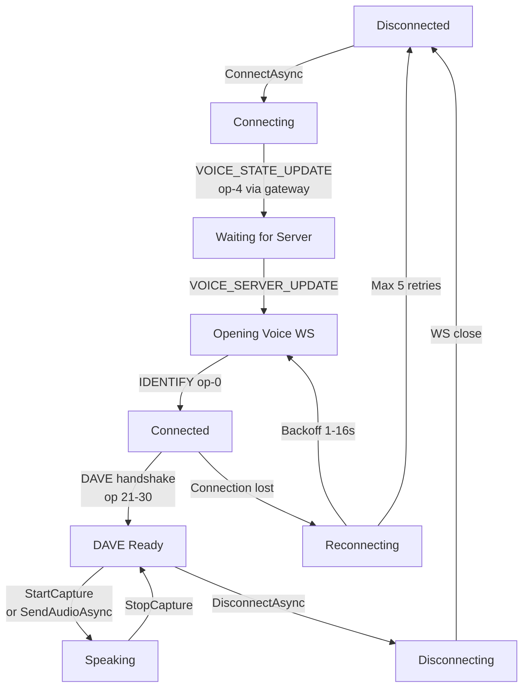

# Voice

PawSharp.Voice implements the Discord Voice Protocol with Opus audio via Concentus and DAVE end-to-end encryption using MLS (RFC 9420). All cryptographic operations use .NET 10 BCL types — no external crypto libraries.

> **Prerequisites:** [Gateway Events](./gateway.md), [DiscordClient setup](../getting-started.md)

---

## Installation

```xml
<PackageReference Include="PawSharp.Voice" Version="1.1.0-alpha.4" />
```

```bash
dotnet add package PawSharp.Voice
```

This pulls in:
- **NAudio** — audio device capture/playback
- **Concentus** — Opus codec (encode/decode)
- Everything else comes from the .NET 10 BCL (AesGcm, HKDF, ECDiffieHellman, ECDsa)

---

## Voice Connection Lifecycle



| State | Description |
|---|---|
| `Disconnected` | Initial state, no voice activity |
| `Connecting` | Sending op-4, waiting for server info |
| `Connected` | Voice WebSocket open, DAVE may not be active yet |
| `Disconnecting` | Sending WS close, tearing down audio |
| `Reconnecting` | Exponential backoff retry (1s → 2s → 4s → 8s → 16s) |

---

## Basic Connection

```csharp
using PawSharp.Voice.Extensions;

// Get the voice extension
var voice = client.UseVoice();

// Fetch a voice channel
var channel = await client.Rest.GetChannelAsync(voiceChannelId);

// Connect — handles op-4, waits for VOICE_SERVER_UPDATE, opens WS
var conn = await voice.ConnectAsync(channel);

Console.WriteLine($"Connected: {conn.State}"); // Connected
```

`ConnectAsync` blocks until the full handshake (including DAVE key exchange) completes. The returned `VoiceConnection` is ready to send/receive audio.

---

## Sending Audio

### From Microphone

```csharp
// Start capture from default mic (48 kHz / 16-bit / mono)
conn.StartCapture();

// Raise speaking gate (automatically called by StartCapture)
// await conn.SetSpeakingAsync(true);

// ... let the bot run ...

// Stop capture
conn.StopCapture();
// Speaking gate is lowered automatically
```

The mic pipeline:
```
WaveInEvent → PCM buffer (20ms / 1920 bytes) → Opus encode → RTP header
→ DAVE encrypt (AES-128-GCM) → WebSocket.SendAsync
```

### From Pre-recorded PCM

`SendAudioAsync` accepts raw 48 kHz / 16-bit / mono PCM data. It buffers internally and sends complete 20 ms frames (1920 bytes each).

```csharp
byte[] pcm = File.ReadAllBytes("audio.raw");

await conn.SetSpeakingAsync(true);
await conn.SendAudioAsync(pcm);
await conn.SetSpeakingAsync(false);
```

⚠️ **Input must be 48 kHz / 16-bit / mono.** Use NAudio or FFmpeg to resample if needed.

### Streaming from a File

```csharp
const int ChunkSize = 3840; // 40 ms (2 frames)

await conn.SetSpeakingAsync(true);

using var fs = File.OpenRead("audio.raw");
var buf = new byte[ChunkSize];
int read;

while ((read = await fs.ReadAsync(buf)) > 0)
{
    await conn.SendAudioAsync(buf[..read]);

    // Pace at roughly real-time to avoid flooding the WebSocket
    await Task.Delay(40);
}

await conn.SetSpeakingAsync(false);
```

### Playing via NAudio (Automatic Resampling)

```csharp
using NAudio.Wave;

// Open any format NAudio supports (MP3, WAV, FLAC, etc.)
using var reader = new AudioFileReader("music.mp3");

// PlayAsync resamples to 48 kHz automatically
using var cts = new CancellationTokenSource();
await conn.PlayAsync(reader, cts.Token);
```

---

## Receiving Audio

Incoming packets are automatically decrypted and decoded:

```
Binary WS message → Parse RTP header → DAVE decrypt (AES-128-GCM)
→ Opus decode → 16-bit PCM → NAudio BufferedWaveProvider → audio output
```

On headless servers (no audio hardware), `WaveOutEvent` init fails silently and playback becomes a no-op.

### Intercepting Received PCM

```csharp
// Write decoded PCM to disk
conn.OnAudioReceived += (ssrc, pcmData) =>
{
    var filename = $"recv_{ssrc}_{DateTime.UtcNow:yyyyMMddHHmmss}.pcm";
    File.WriteAllBytesAsync(filename, pcmData);
};
```

💡 **For custom processing**, feed PCM into your own pipeline using `PlayAudioFromPcmAsync`.

---

## Voice State Tracking

The `VoiceClient` tracks all active connections:

```csharp
// List all active voice connections
foreach (var (channelId, connection) in voice.ActiveConnections)
{
    Console.WriteLine($"Channel {channelId}: {connection.State}");
}

// Disconnect from a specific channel
await voice.DisconnectAsync(channel);

// Disconnect all
await voice.DisconnectAllAsync();
```

---

## Speaking Gate (op 5)

Discord's voice server will not route your audio to other participants until you send a `Speaking` payload:

```json
{ "op": 5, "d": { "speaking": 1, "delay": 0, "ssrc": 12345678 } }
```

```csharp
await conn.SetSpeakingAsync(true);  // Start broadcasting
await conn.SetSpeakingAsync(false); // Stop broadcasting
```

- `StartCapture()` automatically calls `SetSpeakingAsync(true)`
- `StopCapture()` automatically calls `SetSpeakingAsync(false)`
- For raw `SendAudioAsync`, you must call `SetSpeakingAsync` yourself
- The method is idempotent — duplicate calls with the same value only send once

---

## DAVE E2EE Overview

DAVE (Discord Audio Video End-to-End Encryption) uses **MLS (RFC 9420)** for group key agreement and **AES-128-GCM** for per-frame encryption.

### Handshake Sequence

```
Server   → Client: op 21 (DavePrepareTransition)
Client   → Server: op 23 (DaveTransitionReady) with MLS key package
Server   → Client: op 22 (DaveExecuteTransition)
Server   → Client: op 24 (DavePrepareEpoch)
Server   → Client: op 25 Binary (DaveMlsExternalSender) — credential + public key
Client   → Server: op 26 Binary (DaveMlsKeyPackage) — MLS key package
Server   → Client: op 30 Binary (DaveMlsWelcome) — MLS Welcome message
Client processes Welcome → DAVE encryption activated
```

### Packet Wire Format

```
┌──────────────────────────────────────────────────────────────────────┐
│  12 bytes RTP fixed header  (version, PT=120, seq, ts, SSRC)        │
│  ─── passed as Additional Authenticated Data (AAD) to AES-128-GCM ──│
├─────────────────────────────┬────────────────────┬───────────────────┤
│  8-byte monotonic counter   │  N bytes ciphertext │  16 bytes auth tag │
│  (frame sequence number)    │  (encrypted Opus)   │  (GCM tag)         │
└─────────────────────────────┴────────────────────┴───────────────────┘
```

The RTP header is included as AAD, so any tampering with sequence number, timestamp, or SSRC causes decryption to fail.

### Per-Sender Key Derivation

Each SSRC gets its own AES-128 key derived from the epoch secret:

```
HKDF-Expand(
    prk   = epoch_secret,
    info  = "Discord Secure Frames v0 sender" ++ ssrc_big_endian_4_bytes,
    okm_len = 16
)
```

Keys are cached in the MLS state and wiped on every epoch transition (when someone joins/leaves).

### Epoch Transitions

When participants join or leave, the server sends MLS proposals (op 27), the client submits a Commit+Welcome (op 28), and the server confirms the epoch advancement (op 29). All cached sender keys are invalidated, and the frame counter resets to zero.

### Cryptographic Components

| Layer | Algorithm | .NET Type |
|---|---|---|
| Frame encryption | AES-128-GCM | `AesGcm` |
| Key derivation | HKDF-SHA256 | `HKDF` |
| DH key agreement | P-256 ECDH | `ECDiffieHellman` |
| Signing | ECDSA P-256 | `ECDsa` |
| Symmetric encryption | AES-128-GCM (HPKE) | `AesGcm` |
| Ratchet tree | TreeKEM (RFC 9420) | `PawSharp.Voice.DAVE.MLS.Tree` |
| Key schedule | RFC 9420 §8 | `MLSKeySchedule` |

All crypto uses pure managed .NET — no P/Invoke or native DLLs.

---

## Disconnecting and Reconnecting

```csharp
// Graceful disconnect
await conn.DisconnectAsync();

// Reconnect creates a fresh WebSocket and re-runs the full handshake
conn = await voice.ConnectAsync(channel);
```

Automatic reconnection on unexpected disconnect:

```
attempt 1 → wait 1s
attempt 2 → wait 2s
attempt 3 → wait 4s
attempt 4 → wait 8s
attempt 5 → wait 16s → give up, transition to Disconnected
```

---

## Complete Example

```csharp
using PawSharp.Voice.Extensions;

public class VoiceBot
{
    private readonly DiscordClient _client;
    private VoiceConnection? _connection;

    public VoiceBot(DiscordClient client) => _client = client;

    public async Task JoinAndPlayAsync(ulong guildId, ulong voiceChannelId, string audioFile)
    {
        var voice = _client.UseVoice();
        var channel = await _client.Rest.GetChannelAsync(voiceChannelId);
        _connection = await voice.ConnectAsync(channel);

        Console.WriteLine($"Connected to voice, state: {_connection.State}");

        // Play a file
        using var reader = new NAudio.Wave.AudioFileReader(audioFile);
        using var cts = new CancellationTokenSource();
        await _connection.PlayAsync(reader, cts.Token);

        Console.WriteLine("Playback finished.");
    }

    public async Task LeaveAsync()
    {
        if (_connection != null)
        {
            await _connection.DisconnectAsync();
            _connection = null;
        }
    }
}

// Slash command handler
handler.RegisterCommand("join", async interaction =>
{
    var guildId = interaction.GuildId;
    if (guildId == null)
    {
        await handler.RespondEphemeralAsync(interaction.Id, interaction.Token,
            "This command can only be used in a server.");
        return;
    }

    // Get the user's voice channel
    var member = await rest.GetGuildMemberAsync(guildId.Value,
        interaction.Member?.User.Id ?? interaction.User?.Id);
    var voiceState = member.VoiceState;

    if (voiceState?.ChannelId == null)
    {
        await handler.RespondEphemeralAsync(interaction.Id, interaction.Token,
            "You must be in a voice channel first.");
        return;
    }

    await handler.DeferAsync(interaction.Id, interaction.Token);

    var voice = client.UseVoice();
    var channel = await rest.GetChannelAsync(voiceState.ChannelId.Value);
    var conn = await voice.ConnectAsync(channel);

    await handler.EditResponseAsync(applicationId, interaction.Token,
        new EditMessageRequest { Content = $"✅ Joined <#{voiceState.ChannelId}>" });
});
```

---

## Current Limitations (Alpha)

- **Opus FEC** — Forward error correction not implemented on the receive path. Dropped packets produce silence.
- **Stereo capture** — Mic capture is mono only. Stereo will be added in a future release.
- **DAVE group leave** — On disconnect, the bot does not send an MLS `Remove` proposal. The server issues a new Welcome on reconnect, so this is benign in practice.
- **Exposed receive hook** — The library does not currently expose a public callback for raw decoded PCM inside the receive loop. Use `OnAudioReceived` for now.

---

## Related Guides

- [Gateway Events](./gateway.md) — Voice state updates over the gateway
- [Patterns Guide](extension-system.md) — Integration patterns
- [Voice Guide (detailed)](../guides/voice.md) — Full DAVE internals and protocol details
