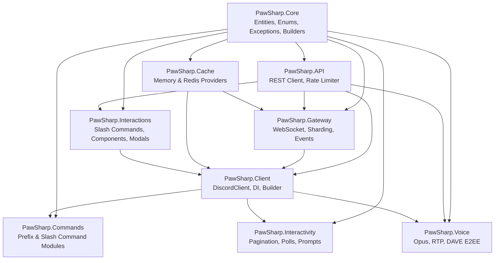

# PawSharp Developer Documentation

> Build Discord bots without fighting your framework.

Welcome to the PawSharp developer documentation. This site contains everything you need to build, deploy, and scale Discord bots using .NET 10. PawSharp is a modular, async-first Discord API wrapper with full REST and Gateway support, slash commands, components, voice with DAVE E2EE, and a pluggable caching layer.

**Current version:** `1.1.0-alpha.5` &middot; **Discord API:** v10 &middot; **Target:** .NET 10.0

---

## Getting Started

New to PawSharp? Work through these guides in order:

| Guide | Description |
|-------|-------------|
| [Installation](./installation.md) | System requirements, NuGet packages, building from source |
| [Getting Started](./getting-started.md) | What PawSharp is, architecture, and a "Hello, World!" bot |
| [Your First Bot](./guides/first-bot.md) | Step-by-step tutorial: create, token, code, run, extend |

---

## Guides

### Core

| Guide | Topics |
|-------|--------|
| [Gateway](guides/gateway.md) | WebSocket connection, heartbeat, resume, reconnection, event dispatch |
| [Events](guides/events.md) | 60+ typed events, event filtering, middleware, interest filtering |
| [Messages](guides/sending-messages.md) | Send, edit, delete, reply, forward, search, crosspost |
| [Slash Commands](guides/slash-commands.md) | Application commands, options, permissions, groups, autocomplete |

### Features

| Guide | Topics |
|-------|--------|
| [Components](guides/components.md) | Buttons, select menus, action rows, component builders |
| [Modals](guides/modals.md) | Modal dialogs, text inputs, submission handling |
| [Embeds](guides/embeds.md) | EmbedBuilder, rich embeds, limits, templates |
| [Attachments](guides/attachments.md) | File uploads, attachment metadata, download helpers |
| [Permissions](guides/permissions.md) | Permission bits, role hierarchy, channel overwrites, computed permissions |

### Advanced

| Guide | Topics |
|-------|--------|
| [Voice](guides/voice.md) | Join/leave voice, Opus audio, DAVE E2EE, receive audio |
| [Threads](guides/threads.md) | Create, join, archive, delete threads, thread member management |
| [Webhooks](guides/webhooks.md) | Create webhooks, execute, edit, slash command webhooks |
| [Auto Moderation](guides/auto-moderation.md) | Rules, triggers, actions, keyword and spam filtering |
| [Scheduled Events](guides/scheduled-events.md) | Create, modify, cancel guild events, event users |

### System

| Guide | Topics |
|-------|--------|
| [Rate Limits](guides/rate-limits.md) | Bucket tracking, global limits, retry logic, telemetry |
| [Caching](guides/caching.md) | In-memory and Redis cache, TTL, eviction, telemetry, health checks |
| [Logging](guides/logging.md) | ILogger integration, structured logging, console/file/serilog |
| [Error Handling](guides/error-handling.md) | Exception hierarchy, global handlers, graceful degradation |

### Scaling

| Guide | Topics |
|-------|--------|
| [Sharding](guides/sharding.md) | Auto-sharding, shard rebalancing, multi-process |
| [Performance](guides/performance.md) | Memory optimization, cache strategies, connection pooling |
| [Memory](guides/memory-usage.md) | LRU eviction, per-entity TTL, metrics |

---

## Architecture

PawSharp is organized into nine NuGet packages with a clear layered dependency graph:

**Key relationships:**

- `PawSharp.Core` is the foundation — every package depends on it.
- `PawSharp.Client` is the recommended all-in-one package; it aggregates the API, Gateway, Cache, and Interactions packages.
- `PawSharp.Voice` builds on Client, API, and Gateway.
- `PawSharp.Commands` builds on Client, API, and Core.
- `PawSharp.Interactivity` builds on Client and Core.

---

## API Reference

Detailed API documentation is generated from XML doc-comments in each source project.

| Package | Namespace | Key Types |
|---------|-----------|-----------|
| **PawSharp.Core** | `PawSharp.Core` | `Guild`, `Channel`, `Message`, `User`, `Role`, `Embed`, `EmbedBuilder`, `GatewayIntents`, `SnowflakeUtils` |
| **PawSharp.API** | `PawSharp.API` | `IDiscordRestClient`, `RestClient`, `AdvancedRateLimiter`, `RateLimitBucket` |
| **PawSharp.Gateway** | `PawSharp.Gateway` | `GatewayClient`, `EventDispatcher`, `ShardManager`, `HeartbeatManager`, `ReconnectionManager` |
| **PawSharp.Cache** | `PawSharp.Cache` | `IEntityCache`, `MemoryCacheProvider`, `RedisCacheProvider`, `CacheSwapper`, `CacheTelemetry` |
| **PawSharp.Client** | `PawSharp.Client` | `IDiscordClient`, `DiscordClient`, `PawSharpClientBuilder`, `PawSharpOptions`, `CacheManager` |
| **PawSharp.Commands** | `PawSharp.Commands` | `BaseCommandModule`, `CommandAttribute`, `CommandsExtension`, `CommandContext` |
| **PawSharp.Interactions** | `PawSharp.Interactions` | `InteractionHandler`, `SlashCommandBuilder`, `ComponentBuilder`, `ModalBuilder` |
| **PawSharp.Interactivity** | `PawSharp.Interactivity` | `InteractivityExtension`, `Paginator`, `PollManager` |
| **PawSharp.Voice** | `PawSharp.Voice` | `VoiceClient`, `VoiceConnection`, `DAVEProtocol`, `DAVEEncryption` |

---

## FAQ

**Q: What .NET version do I need?**  
A: .NET 10.0 SDK or later. PawSharp targets `net10.0`.

**Q: Can I use PawSharp with ASP.NET or a hosted service?**  
A: Yes. PawSharp integrates with `Microsoft.Extensions.DependencyInjection`. Use `AddPawSharp()` in `ConfigureServices` for background service scenarios. See the DashboardBot example.

**Q: How do I test my bot logic?**  
A: All major abstractions — `IDiscordClient`, `IDiscordRestClient`, `IGatewayClient`, `IEntityCache` — are interfaces, fully mockable with Moq, NSubstitute, or your mock framework of choice.

**Q: How many guilds can a single instance handle?**  
A: Typically 2500+ guilds per shard. Use `PawSharp.Gateway.ShardManager` with auto-sharding for larger bots.

**Q: Do I need Redis?**  
A: No. The default `MemoryCacheProvider` works well for most bots. For bots serving 500+ guilds or requiring cache persistence across restarts, use `RedisCacheProvider`.

**Q: Does PawSharp support native AOT?**  
A: Yes. PawSharp uses `JsonSerializerContext`-based source generation for all JSON serialization — no runtime reflection, trimming-safe.

**Q: Is voice production-ready?**  
A: Voice is functional (Opus encode/decode, RTP, DAVE E2EE) and used in music bots, but is still alpha — expect API changes.

---

## Troubleshooting

| Issue | Guide |
|-------|-------|
| Bot won't connect | [FAQ - Gateway](faq.md#gateway) |
| Events not firing | [FAQ - Events](faq.md#events) |
| Rate limited / 429 errors | [Rate Limits Guide](guides/rate-limits.md) |
| High memory usage | [Memory Usage Guide](guides/memory-usage.md) |
| Slash commands not showing | [Slash Commands Guide](guides/slash-commands.md) |
| Voice not working | [Voice Guide](guides/voice.md) |
| Migration from another library | [Migration Guide](migration.md) |
| Still stuck | [Open a GitHub issue](https://github.com/M1tsumi/PawSharp/issues) |

---

## Contributing

We welcome contributions! See [CONTRIBUTING.md](../CONTRIBUTING.md) for guidelines.

- **Report bugs** via [GitHub Issues](https://github.com/M1tsumi/PawSharp/issues)
- **Discuss ideas** on [GitHub Discussions](https://github.com/M1tsumi/PawSharp/discussions)
- **Join the community** on [Discord](https://discord.gg/6Z8X8cCHXs)

### Quick contribution checklist

1. Read [CONTRIBUTING.md](../CONTRIBUTING.md)
2. Check existing issues and discussions
3. Fork the repo and create a feature branch
4. Run `dotnet build` to verify compilation
5. Run `dotnet test` to verify tests pass
6. Submit a pull request

---

## External Resources

- [Discord Developer Portal](https://discord.com/developers/applications)
- [Discord API Documentation](https://discord.com/developers/docs)
- [.NET 10 SDK](https://dotnet.microsoft.com/download/dotnet/10.0)
- [NuGet: PawSharp.Client](https://www.nuget.org/packages/PawSharp.Client)

---

## Documentation Version

**Last updated:** July 8, 2026 &middot; **PawSharp version:** `1.1.0-alpha.5`

Documentation covers all releases from `1.0.0-alpha.1` onward. Breaking changes between alpha releases are documented in [migration.md](migration.md) and [../CHANGELOG.md](../../CHANGELOG.md).
